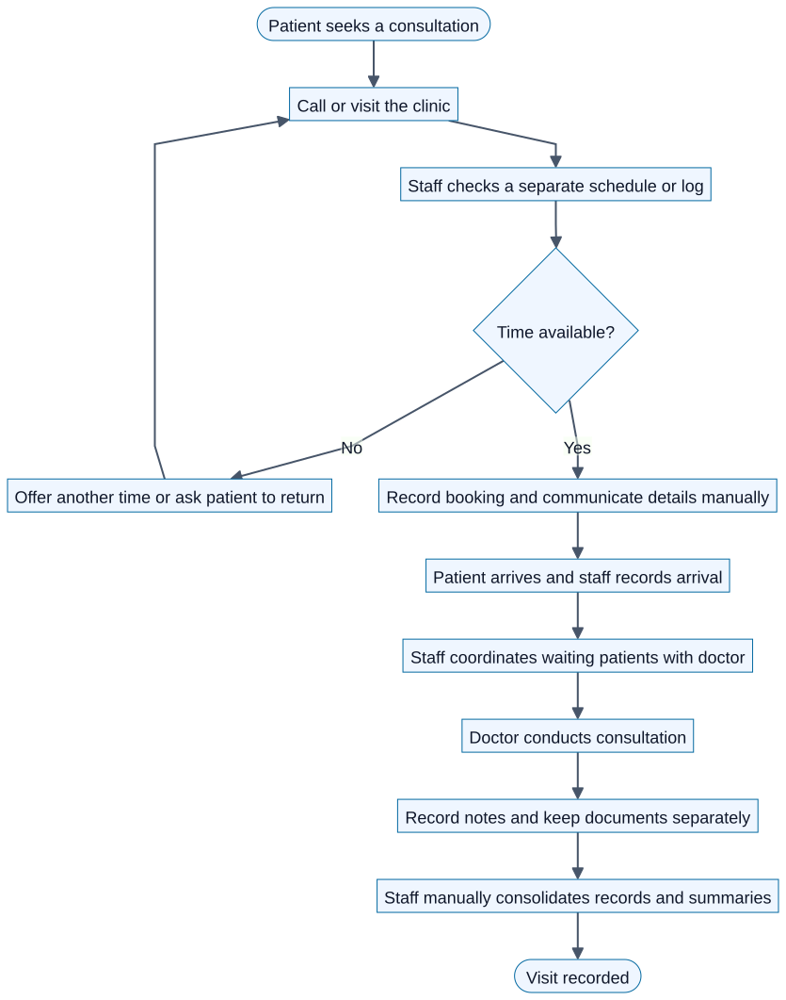
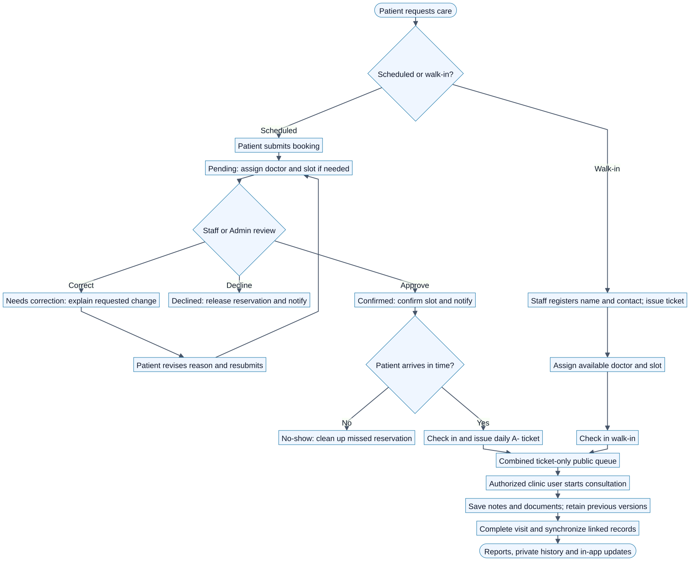
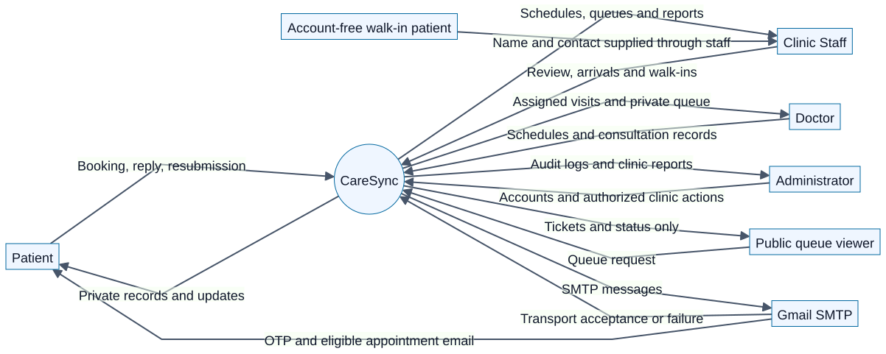
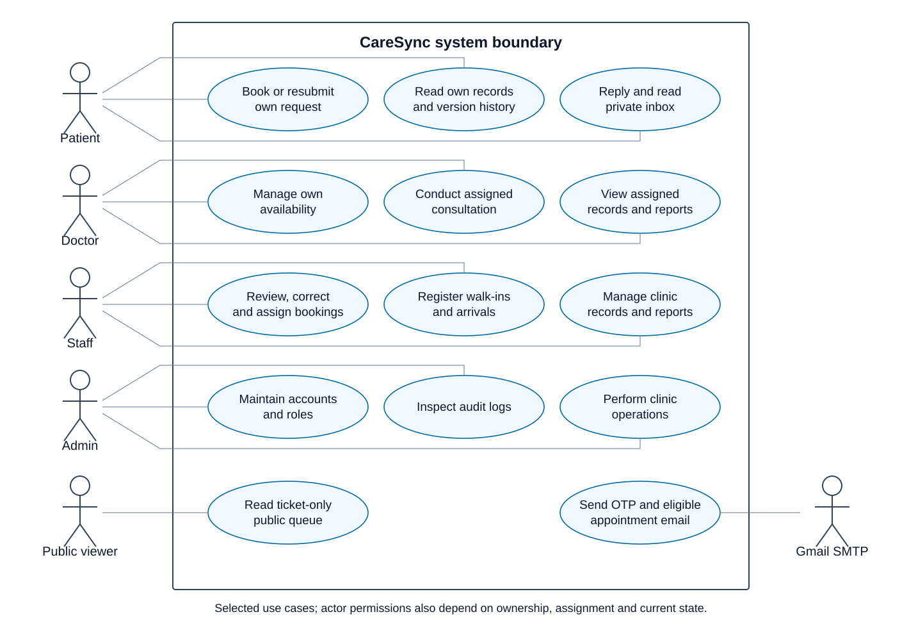
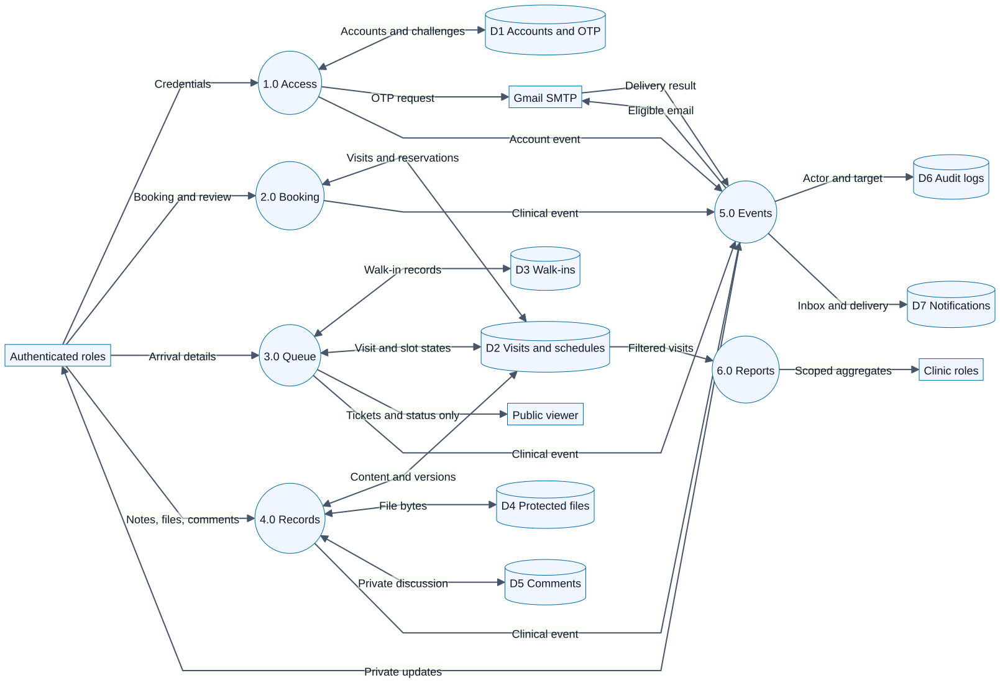
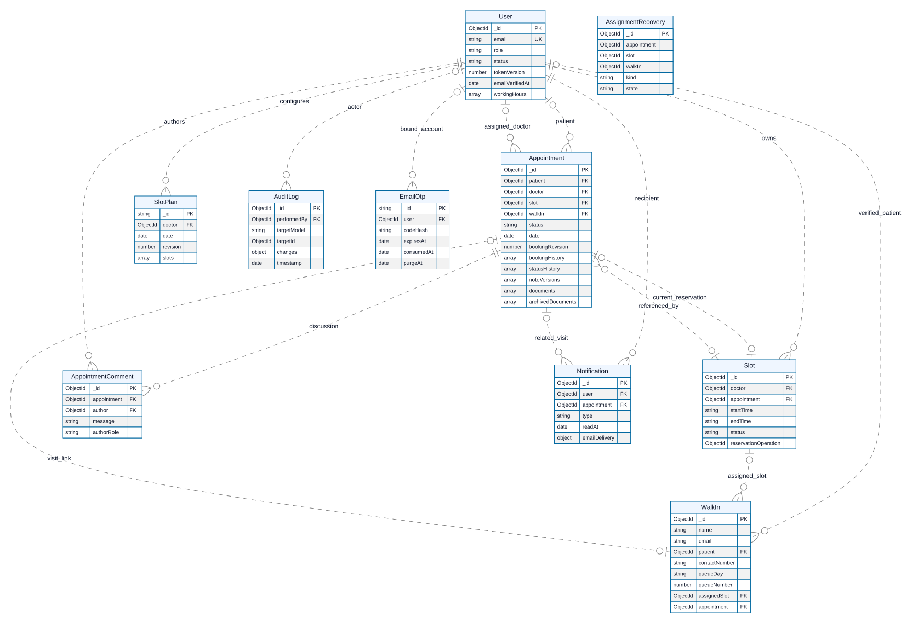
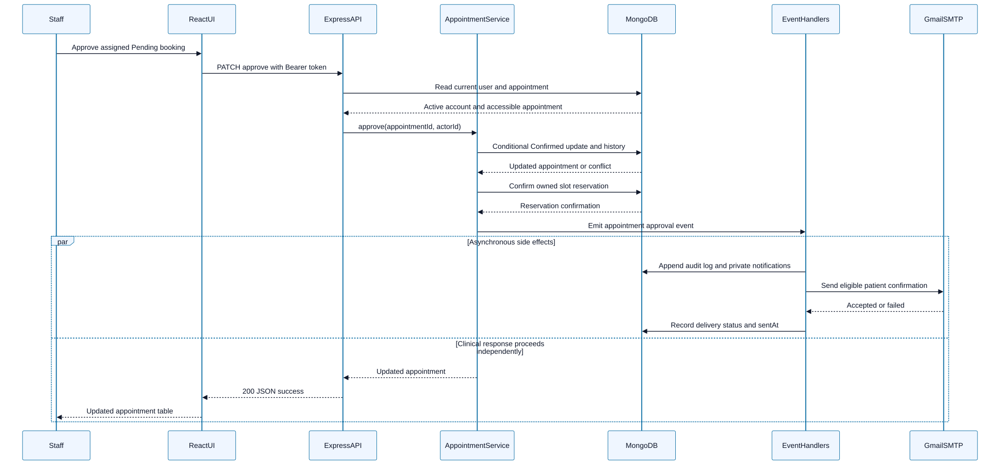
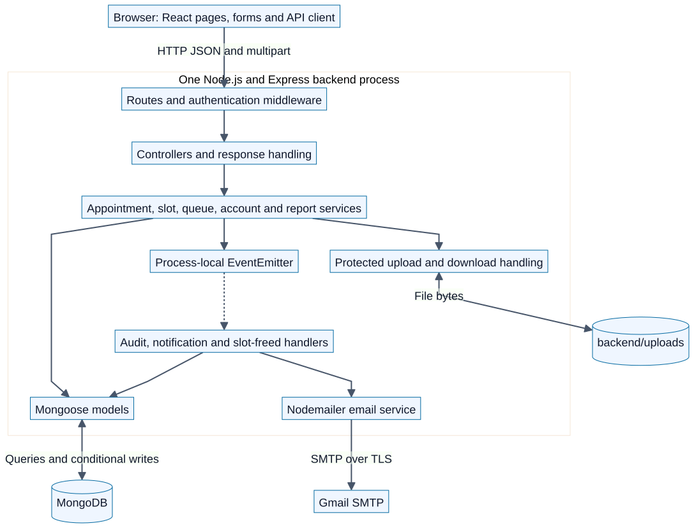
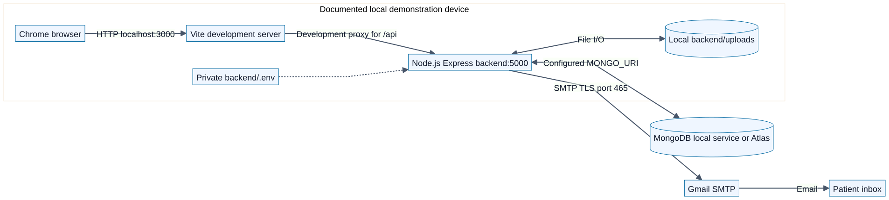

# CareSync

## Healthcare Appointment, Queue, and Patient Notification Integration System

**Final Project Paper — Working Draft**

**Institution:** [TO COMPLETE: school/university]  
**College/department:** [TO COMPLETE]  
**Course and section:** [TO COMPLETE]  
**Submitted to:** [TO COMPLETE: instructor]  
**Submitted by:** [TO COMPLETE: team members]  
**Clinic or demonstration organization:** [TO COMPLETE]  
**Date:** October 6, 2026 (Asia/Manila)

### Draft status and evidence boundary

This paper describes the CareSync codebase inspected on October 6, 2026. The latest recorded application verification is October 4, 2026. The last committed baseline is `e179fd1`; unrelated uncommitted demo-reset work exists and is excluded from the feature evaluation in this paper. No application tests were rerun while preparing this document.

The structure follows the requirements transcribed in the repository's project specification gap analysis [R1]. The original file, *Final Project Specification_MWA.pdf*, was unavailable at its recorded local path during preparation. Confirm this draft against the instructor's original document and required citation/formatting style before submission. Names, field observations, deployment details, performance measurements, screenshots, and unfinished tests are explicitly identified rather than invented.

### Abstract

CareSync is a web-based prototype that integrates appointment booking, doctor availability, scheduled arrivals, walk-in queues, consultation records, review feedback, reporting, and patient notifications. Patients use a dedicated dashboard to request appointments and view their own records. Staff coordinate review, arrivals, and walk-ins; Doctors manage assigned visits; Administrators maintain accounts and inspect audit logs. A React frontend communicates with an Express API backed by MongoDB, while protected files remain in the backend upload directory. Process-local application events connect clinical actions with audit records, private notifications, and slot-freed reassignment. Gmail SMTP supports account verification codes and selected patient appointment outcomes.

Recorded verification includes thirteen isolated backend suites, browser checks with mocked APIs, a frontend production build, and live concurrency checks in a disposable MongoDB database. Gmail authentication and selected delivery metadata were verified, and the project owner confirmed receiving account codes and appointment emails. These results support the implemented controls within their tested environments; they do not establish complete live clinic operation, production availability, or durable event delivery. The remaining evaluation work includes the full patient journey, recovery demonstrations, deployment evidence, and final submission artifacts.

### Contents

1. Introduction
2. Current-State Analysis
3. Requirements Analysis
4. Enterprise Architecture
5. Target-State Architecture
6. System Design
7. Integration Design and Implementation
8. Security, Governance, and Risk Management
9. Testing and Evaluation
10. Deployment, Backup, and Recovery
11. System Demonstration Guide
12. Limitations and Future Enhancements
13. Individual Contribution
14. References
15. Appendices

## 1. Introduction

### 1.1 Background

A clinic visit involves several related activities: selecting a consultation time, confirming a doctor, reviewing the request, recording arrival, managing the waiting queue, documenting care, and informing the patient. When these activities use disconnected records, each participant must coordinate changes manually. A cancellation can affect both the schedule and queue, while a revised booking reason needs to remain understandable to the reviewer. CareSync organizes these activities around linked appointment, slot, and walk-in records.

### 1.2 Problem statement

The project addresses the design problem of keeping appointment and queue information consistent across patient and clinic workflows while controlling access to medical records. Its core questions are how to prevent competing reservations, distinguish arrival from consultation start, retain review and content history, communicate relevant updates, and show staff a consolidated view of clinic activity.

No clinic interviews or measured baseline waiting times were supplied for this draft. The problem statement is a project design rationale. Claims about a particular clinic's operating problems must be supported by the team's own observations before submission.

### 1.3 Objectives

The general objective is to implement and evaluate an integrated appointment, queue, and notification prototype for a healthcare setting. Specific objectives are to support four account roles; maintain doctor schedules and guarded reservations; provide booking approval, correction, and resubmission; combine scheduled and walk-in arrivals on a private-data-safe queue board; preserve consultation records and prior content; connect workflow events to notifications and audits; and produce scoped, date-filtered reports.

### 1.4 Scope and stakeholders

The scope includes a responsive web interface and a single backend application. Stakeholders are Patients, walk-in patients with optional accounts, Doctors, Staff, Administrators, and the project evaluator. Staff register walk-ins using name and email; no login is needed to join the queue or receive care. A later OTP-verified signup using the same email links earlier walk-in visits to that account. The public queue viewer sees ticket/status information only.

Gmail email and the private in-app inbox are the agreed notification channels. Paid SMS delivery is excluded under the project owner's resource constraint; instructor acceptance of this specification mapping remains to be confirmed. The system does not implement billing, insurance processing, pharmacy inventory, diagnostic interpretation, or a hospital-wide electronic health record.

## 2. Current-State Analysis

### 2.1 Baseline process

Figure 1 is an **assumed manual baseline for analysis**, not an observed description of a named clinic. A patient calls or visits, staff checks an independent schedule, records an available time, and communicates the booking. On arrival, staff coordinates the waiting order with the doctor. Notes and documents are retained separately, and staff consolidates summaries afterward.



### 2.2 Potential coordination problems

Separate schedules, queue lists, and consultation files can create duplicated entry and delayed updates. A booking may be accepted while another user takes the same time, a patient may receive outdated instructions, or a clinic worker may need to search multiple records to understand a previous change. These are risks the design addresses; their frequency and severity at the chosen clinic have not been measured.

### 2.3 Current-state validation to complete

Interview or observe the selected organization and record the booking channel, review authority, schedule owner, queue policy, record storage, notification channel, and reporting process. Replace the assumed baseline with the confirmed process. Attach dated interview notes or approved observations in Appendix E. Record baseline waiting time, processing effort, or error rates only if the team actually measures them.

## 3. Requirements Analysis

### 3.1 Functional requirements

These requirements express the implemented project scope. Acceptance evidence is separated from implementation status in Section 9.

| ID | Requirement | Acceptance criterion | Stakeholder | Module |
| --- | --- | --- | --- | --- |
| FR01 | Authenticate and manage role accounts. | A valid login opens the correct role dashboard; Admin can create, edit, deactivate, and reactivate accounts. | All roles | Identity |
| FR02 | Verify Patient signup and password changes/reset using email codes. | A purpose-bound, valid unused OTP permits the relevant action; expired/replayed codes fail and password changes invalidate older sessions. | Patient | Identity/OTP |
| FR03 | Maintain doctor working hours and dated slots. | Authorized users save weekly hours and duration; generated slots respect stored windows and guard overlapping generation. | Doctor, Staff, Admin | Scheduling |
| FR04 | Submit appointment requests. | An authenticated Patient creates a Pending request; a selected available slot is claimed or a conflict is returned. | Patient | Booking |
| FR05 | Assign flexible requests later. | Staff/Admin attaches an available doctor and slot; an unassigned request cannot be approved. | Staff, Admin | Assignment |
| FR06 | Review requests through approval, decline, or correction. | Permitted actors perform valid transitions; a correction explanation and prior reason are retained. | Staff, Admin; assigned Doctor for decline | Review |
| FR07 | Resubmit corrected booking reasons. | Only the owning Patient revises the reason of a Needs correction request and returns it to Pending with history. | Patient | Review |
| FR08 | Register and assign walk-ins with optional accounts. | Staff/Admin collects name/email and allocates a unique daily ticket. Later OTP-verified signup with the same email links earlier visits. | Walk-in, Staff, Admin | Walk-in queue, patient portal |
| FR09 | Separate arrival from consultation start. | Arrival records Checked In; an authorized separate action changes the visit to In Progress. | Clinic roles | Consultation |
| FR10 | Display a combined public queue. | Scheduled arrival tickets and walk-in tickets appear with statuses; public data omits patient identity and medical details. | Public viewer, clinic | Queue display |
| FR11 | Cancel visits and handle no-shows. | Permitted transitions synchronize linked reservations; automatic missed-visit processing does not mark checked-in patients as absent. | Patient, clinic roles | Visit lifecycle |
| FR12 | Maintain protected consultation notes and documents. | Authorized clinic users save notes/upload allowed files; the owner or assigned Doctor can access permitted downloads. | Patient, Doctor, clinic | Records |
| FR13 | Preserve record revisions. | Changed notes and replaced/archived documents retain readable prior versions with available author/time metadata. | Patient, clinic | Version tracking |
| FR14 | Support private appointment discussions. | Authorized participants post/read plain-text comments with author, role, and timestamp; another Patient cannot access the thread. | Patient, clinic | Feedback |
| FR15 | Deliver private notifications and selected email. | Each recipient reads their own inbox; only eligible Patient outcomes send appointment email and expose sanitized delivery status. | All roles | Notifications |
| FR16 | Produce scoped reports. | Valid date ranges return status/daily/doctor aggregates; a Doctor's report is restricted to that Doctor. | Staff, Admin, Doctor | Reports |
| FR17 | Record agreed audit events. | Clinical and agreed account/document/slot-generation actions produce actor/target metadata available to Admin. | Admin | Audit |

### 3.2 Nonfunctional requirements

The thresholds below are **proposed acceptance criteria**, not measured results. Where a test has not been performed, the status remains pending.

| ID | Quality requirement | Assessable criterion | Current evidence or remaining work |
| --- | --- | --- | --- |
| NFR01 | Access control | Private requests require a valid active account and permitted role/record scope; cross-account record access is denied. | Isolated access suite recorded passed; live deployment checks pending. |
| NFR02 | Public privacy | Public queue payload contains ticket and status only, with no names, contacts, notes, or documents. | Implemented and isolated-tested; capture deployed payload. |
| NFR03 | Reservation consistency | Concurrent attempts for a single available slot produce at most one owner; daily ticket keys are unique. | Live disposable-database concurrency suite recorded passed. |
| NFR04 | Revision integrity | Stale revision writes fail rather than replacing a newer booking/note/document revision; unchanged notes add no version. | Recorded correction/version checks passed; live cases pending. |
| NFR05 | Error isolation | An SMTP failure preserves the private inbox record and does not undo a committed clinical action. | Isolated email failure checks passed; live outage evidence pending. |
| NFR06 | Responsive usability | Required role workflows remain operable at 390 px and 1440 px without inaccessible controls. | Focused mocked browser checks passed; wider usability review pending. |
| NFR07 | Performance | Proposed target: 95th percentile under 2 seconds for ordinary list/report requests with 10 concurrent demo users and 1,000 synthetic visits, excluding SMTP. | No load result recorded; run and document workload/environment. |
| NFR08 | Recoverability | Proposed target: restore MongoDB and matching uploads to a separate environment within 60 minutes, losing at most one daily backup interval. | Backup/restore demonstration pending; target requires agreement. |
| NFR09 | Maintainability | A fresh device can install lockfile dependencies, configure private environment values, start the application, and run documented checks. | README procedure exists; independent reproduction pending. |
| NFR10 | Secret handling | No passwords, OTP codes, JWT secrets, SMTP credentials, or database URIs appear in the submission evidence or client bundle. | Ignored configuration and bounded delivery codes exist; review final artifacts. |

### 3.3 Traceability and healthcare mapping

The specification's generic submission, approval, version, and feedback concepts map respectively to consultation files, booking review, note/document revisions, and private appointment discussions. Formal correction/resubmission is a separate reason-only booking workflow. These mappings and use of dialogs as required screens should be confirmed with the instructor.

| Requirements | Figures | Test evidence identifiers | Principal source |
| --- | --- | --- | --- |
| FR01–02, NFR01/10 | 3, 4, 7, 9 | F01, E04, S01, S04 | User/EmailOtp models; auth middleware; accounts/OTP suites |
| FR03–05, NFR03 | 2, 5, 7, 9 | F02, F03, I01, E01 | Slot/SlotPlan/AssignmentRecovery models; concurrency suite |
| FR06–07, NFR04 | 2, 4, 6 | F04, F05, I02, E02 | Appointment service; corrections suite |
| FR08–11, NFR02 | 2, 3, 5 | F06, F07, I03, S03 | WalkIn/Appointment services; queue/no-show suites |
| FR12–14, NFR04 | 4, 5, 9 | F08, F09, I04, E03, S02 | Record/comment services; comments/versions/access suites |
| FR15/17, NFR05 | 3, 5, 6, 7 | I05, I06, E05 | Notification/audit handlers and services |
| FR16, NFR07 | 4, 5, 7 | F10, S05 | Report service; clinic workflows suite |
| NFR06/08/09 | 8 | UI01, REC01, E2E01 | Browser checks, README and proposed recovery procedure |

## 4. Enterprise Architecture

### 4.1 Business architecture

The business capabilities are access administration, appointment coordination, resource scheduling, arrival/queue coordination, consultation documentation, communication, and operational reporting. Patients supply booking information; Staff coordinate service delivery; Doctors perform assigned care; Admin maintains access and supervises evidence. The design supports a single clinic demonstration rather than multi-organization tenancy.

### 4.2 Data architecture and sources of truth

MongoDB stores Users, Appointments, Slots, WalkIns, SlotPlans, AssignmentRecoveries, AppointmentComments, Notifications, AuditLogs, and EmailOtps. Appointment records hold visit status and consultation metadata. Slots hold canonical bookable time windows and reservation ownership. Doctor workingHours describe recurring availability, while SlotPlans coordinate materialized dated windows. WalkIns hold account-free visit identity and queue information.

The upload filesystem stores document bytes; MongoDB stores current and prior file metadata. Both are required for restoration. SMTP acceptance is stored in notification metadata but does not establish inbox delivery. Audit records describe selected actions and do not replace clinical records as the operational source of truth.

### 4.3 Application architecture

React pages call a shared HTTP API client. Express routes apply authentication/authorization, controllers map requests, services enforce workflows, and Mongoose models manage persistence. Application events connect services to audit, notification, and reassignment handlers within the same backend process. Figure 7 shows these logical modules inside one deployable backend; they are not independently deployed services.

### 4.4 Technology architecture

The implementation uses React 18, Vite 6, Node.js/Express 4, Mongoose 8/MongoDB, bcryptjs, JWT, Multer, and Nodemailer. Exact installed versions come from package lockfiles. Local verification was documented with Node.js 24 and Chrome. Gmail SMTP provides external email integration. Socket.IO is declared as a dependency, but no active socket-based queue integration was established in the inspected server startup; no WebSocket capability is claimed.

## 5. Target-State Architecture

### 5.1 Integrated clinic process

Figure 2 connects scheduled requests and account-free walk-ins to one consultation process. Staff/Admin reviews Pending bookings, requests corrections when necessary, and approves only assigned requests. Arrival issues a scheduled A- ticket while preserving the slot. Walk-ins receive their own daily tickets and linked appointments after assignment. A distinct action begins consultation; notes, files, completion, reports, and private notifications follow.



### 5.2 System boundary

Figure 3 distinguishes human roles, the public queue viewer, the CareSync application, and Gmail. The MongoDB database and file store are internal implementation resources and appear in the architecture/DFD rather than as external business actors. An account-free walk-in supplies details through Staff; the walk-in is not represented as a logged-in Patient.



### 5.3 Architecture and integration decisions

| Decision | Selected approach and rationale | Alternatives and consequences |
| --- | --- | --- |
| Application organization | Layered modular monolith suited to one clinic prototype and one backend deployment. | Microservices add network contracts and operating effort without a demonstrated project need. |
| Frontend/backend contract | REST-style HTTP JSON with multipart uploads; role checks remain on the server. | Direct database access from the browser would bypass application control. |
| Internal integration | Process-local events separate clinical services from audit/notification consumers. | A durable broker/outbox offers replay and stronger guarantees but is not implemented. |
| Persistence | MongoDB references connect visit records; embedded arrays retain consultation/booking snapshots. | A relational model could provide different integrity/transaction options but would require redesign. |
| Competing writes | Conditional claims, unique indexes, revisions, and durable assignment recovery records. | Unconditional updates allow double assignment; existing controls do not guarantee atomicity across every workflow. |
| File storage | Local protected uploads with metadata/version links in MongoDB. | Object storage could improve multi-instance operation; local bytes require matching backups. |
| External notifications | Gmail SMTP plus persistent private inbox. | Paid SMS is excluded; email delivery is a single attempt without durable retry. |

## 6. System Design

### 6.1 Actors and use cases

Figure 4 uses UML actor symbols, a named system boundary, and use-case ellipses. Associations show participation; role-specific restrictions are defined in Section 8 and the route middleware. Admin may also perform Staff clinic actions. Shared use cases do not grant unrestricted record access: Patients remain owners and Doctors remain scoped to assigned visits.



### 6.2 Data flow

Figure 5 is a level-one logical DFD. It shows identity, booking/scheduling, queue, records, event handling, and reports with their data stores. Numbered circles are processes; cylinders are stores. Multiple model collections are grouped into a visit store for readability. Arrows represent data movement rather than a guaranteed order of execution.



### 6.3 Appointment and queue states

Scheduled visits commonly move from Pending to Confirmed, Checked In, In Progress, and Completed. A Pending request can enter Needs correction and return to Pending after the owner revises the reason. Declined, Cancelled, and No-show are alternative outcomes subject to permitted starting states. Walk-ins have Waiting, Slot Assigned, Checked In, In Progress, Completed, and Left states. Slot state is synchronized separately; arrival does not begin consultation.

Transition validity, record scope, and concurrency guards are checked server-side. A UI button alone is not the access control. Generic status lists should not be interpreted as permitting every transition between every pair of states.

### 6.4 Database design

Figure 9 is a logical ERD derived from Mongoose models, with ObjectId references shown as relationships. MongoDB does not enforce SQL foreign keys. Embedded note/document/booking/status histories are arrays within Appointment, not separate collections. Audit targetId is polymorphic; AssignmentRecovery holds logical identifiers without Mongoose `ref` declarations. Their linking rules are explained below rather than represented as enforced relational constraints.



| Collection/model | Purpose and principal fields | Integrity considerations |
| --- | --- | --- |
| User | Identity, role, status, hashed password, tokenVersion, doctor hours/duration. | Unique normalized email; service-level role restrictions. |
| Appointment | patient or walkIn, doctor, slot, date/reason/status, daily arrival ticket, consultation content and embedded histories. | Service/model require an identity; assignment fields may be null; unique scheduled ticket per queueDay. |
| Slot | doctor/date/start/end/status, appointment and reservationOperation. | Unique doctor/date/startTime; an owned reservation is claimed conditionally. |
| WalkIn | name/email, optional patient reference, queueDay/queueNumber/status, assignedSlot and appointment; legacy contactNumber retained. | Unique daily ticket for records with queueDay; an account is optional. Verified Patient accounts link without replacing existing ownership. |
| SlotPlan | doctor/date, revision, planned windows. | String key identifies doctor/day plan; revision guards extension. |
| AssignmentRecovery | kind, appointment, slot, optional walkIn, pending/done. | Identifiers are logical links; pending records require offline reconciliation before startup. |
| AppointmentComment | appointment, author, authorName/authorRole snapshot, message. | Plain text up to 2,000 characters; appointment-scoped authorization. |
| Notification | owner user, optional appointment, type/title/message, readAt, emailDelivery. | Owner-only access; delivery status is disabled/pending/sent/failed/skipped. |
| AuditLog | action, optional performedBy, targetModel/targetId, changes, timestamp. | Admin viewer; no application editing workflow; not a tamper-proof external ledger. |
| EmailOtp | purpose/address key, hidden codeHash, attempts, expiry/consumption, user/session binding, purgeAt. | Keyed hash, single-use checks, bounded requests/attempts; TTL cleanup is not the authorization expiry check. |

Appointment.slot can remain on a historical visit after a reusable Slot is freed, so Figure 9 permits multiple historical references to a slot. Slot.appointment represents the current reservation link. Each WalkIn/Appointment link represents one visit. Multiple walk-in visits can link to the same verified Patient account through normalized email; WalkIn.patient and Appointment.patient preserve that ownership. Legacy phone-only records do not match automatically. Service logic governs these relationships. See the [optional walk-in accounts guide](../project_specifications/261006_optional_walkin_accounts_walkthrough.md) for the current policy and implementation checks.

### 6.5 Screen design and navigation

The interface provides login, OTP signup/recovery, role dashboards, booking/assignment dialogs, schedule/slot management, appointment history/comments/corrections, consultation notes/documents/versions, notifications, reports, Admin account management, audit viewing, and the public queue board. Attach synthetic-data screenshots using the capture list in Appendix C. Confirm instructor acceptance of dialogs as the corresponding generic feedback/version screens.

## 7. Integration Design and Implementation

### 7.1 API contracts

The frontend uses `/api` with bearer authentication on private routes. Public exceptions cover login, account OTP/register/reset endpoints, system-time reads, and ticket-only public queue reads. Examples below describe expected contract shapes; they are **illustrative synthetic payloads, not captured live results**. Replace them with sanitized actual requests/responses when assembling integration evidence.

| Purpose | Method and endpoint | Key data |
| --- | --- | --- |
| Submit booking | POST /api/appointments | doctorId/date/slotId/reason; patient identity comes from authenticated account. |
| Assign flexible visit | PATCH /api/appointments/:id/assign | Assignment details validated against available slot. |
| Approve | PATCH /api/appointments/:id/approve | Authorized actor; Pending visit must have doctor/slot. |
| Request correction | PATCH /api/appointments/:id/request-correction | explanation and bookingRevision. |
| Resubmit | PATCH /api/appointments/:id/resubmit | Updated reason and bookingRevision. |
| Check in/start | PATCH /api/appointments/:id/check-in or /start | Authorized clinic actor and valid current state. |
| Notes | PATCH /api/appointments/:id/documents | consultationNotes and notesRevision. |
| Upload | POST /api/appointments/:id/upload | multipart file, type, optional title. |
| History/download | GET /api/appointments/:id/versions or protected document download routes | Owner/assignment/clinic access checks. |
| Reports | GET /api/reports?from=YYYY-MM-DD&to=YYYY-MM-DD | Inclusive date-range behavior implemented via exclusive next-day bound. |

```json
{
  "doctorId": "507f1f77bcf86cd799439011",
  "date": "2026-10-08",
  "slotId": "507f1f77bcf86cd799439012",
  "reason": "Synthetic follow-up visit for demonstration"
}
```

The booking controller returns HTTP 201 with `{ "success": true, "data": ... }`. Appointment actions normally return HTTP 200 with the updated record; errors use HTTP status and a message. Exact negative outcomes depend on which validation fails. Capture actual statuses rather than assigning one universal code to every reservation error.

### 7.2 Event-driven integration

Services emit clinical events after their relevant changes. Registered handlers persist recipient notifications and selected audit records; slot-freed handlers attempt date-scoped walk-in assignment. These are internal process-local events, not webhooks or an external message broker. Node EventEmitter supplies the underlying event API [R7]. Application code adds asynchronous handler tracking, but persisted replay of every event is absent.

Figure 6 illustrates approval after a doctor and slot are assigned. The conditional appointment update protects against stale review; slot confirmation follows. The notification handler stores private updates and attempts eligible email. **The event work runs asynchronously: the clinical HTTP response can complete before audit/SMTP/delivery metadata finishes.** The bottom response arrows show the user result, not a requirement that the API await SMTP. SMTP acceptance is distinct from receipt in the recipient's inbox.



### 7.3 Email policy and failure handling

Only Patients receive appointment email for confirmation, decline, cancellation, and no-show. Routine booking activity, review correction messages, comments, completion updates, and clinic-role activity remain in-app. Account signup/password OTP messages are a separate security flow through the email transport. Nodemailer supplies SMTP transport and verification functionality [R9]. The private inbox record is saved before the appointment email attempt. A bounded error code is retained on failure; raw SMTP errors and credentials are excluded from the UI.

No durable outbox or automatic retry is implemented. A process failure can leave an event unhandled, an email pending, or metadata incomplete. This limitation must be described in evaluation and monitored during demonstration rather than presented as guaranteed delivery.

### 7.4 Application architecture figure

Figure 7 identifies the concrete request path and integration modules. The file path is accessed through authorized application handling. Declared dependencies alone do not establish a live integration.



## 8. Security, Governance, and Risk Management

### 8.1 Security controls

The API validates bearer JWTs, loads the current account, rejects deactivated users, and checks tokenVersion. Record-level middleware restricts appointment access to the Patient owner, assigned Doctor, or clinic Staff/Admin. Passwords are bcrypt-hashed. Email OTP challenges use keyed hashes, purpose binding, expiry, one-time consumption, throttling, and account/session binding. Direct public `/uploads` requests are blocked; downloads pass appointment checks. These implementation controls are supported by isolated security checks [R2, R3].

File uploads have a 25 MB limit, sanitized generated filenames, and an allowed extension list. Extension filtering is not malware scanning or comprehensive content validation. Staff and Admin currently have broad clinic-record access. Additional clinical access segmentation, production TLS, retention policy, host permissions, and legal/privacy review are deployment decisions; this paper makes no compliance certification claim.

### 8.2 Role matrix and separation of responsibilities

| Capability | Patient | Doctor | Staff | Admin |
| --- | --- | --- | --- | --- |
| Submit scheduled booking | Own account | No | No | No |
| View appointment/comments/history | Own | Assigned | Clinic | Clinic |
| Request correction/approve/assign flexible booking | No | No | Yes | Yes |
| Resubmit booking reason | Own Needs correction | No | No | No |
| Decline/cancel when transition permits | Own cancellation | Assigned visits | Clinic | Clinic |
| Check in/start/complete permitted visit | No | Assigned | Clinic | Clinic |
| Save notes and manage files | Read own permitted records | Assigned | Clinic | Clinic |
| Manage working hours/slots | No | Own | Authorized clinic | Authorized clinic |
| Register/assign walk-in | No | Scoped queue actions | Yes | Yes |
| Read reports | No | Own | Clinic | Clinic |
| Maintain accounts/roles | No | No | No | Yes |
| View audit logs | No | No | No | Yes |
| Read notifications | Own | Own | Own | Own |

The role matrix is a summary; exact action, current state, and record ownership also govern permission. Admin control combines several responsibilities for the prototype. An independent reviewer role or four-eyes account approval is not implemented. Governance should assign named owners before deployment rather than imply enforced organizational separation that the software does not provide.

### 8.3 Ownership and governance

| Domain | Proposed accountable owner | Responsibilities |
| --- | --- | --- |
| Accounts and access | Clinic Administrator [name pending] | Role assignment, deactivation, access review, account requests. |
| Schedules and arrival operations | Scheduling lead/Staff [name pending] | Availability, review, queue coordination and correction explanations. |
| Consultation content | Assigned Doctor and clinic records lead [names pending] | Record accuracy, revision rationale, authorized disclosure. |
| Application/configuration | Team technical lead [name pending] | Releases, environment secrets, dependency maintenance and service health. |
| Backups and recovery | Named operator [name pending] | Protected backup sets, restore drills, matching database/file copies. |

Retention periods, consent/privacy notices, incident escalation, access-review frequency, and backup custody must be approved by the selected organization. System-clock changes are Admin-only testing actions excluded from the agreed audit coverage; resulting clinical events retain their existing behavior. Audit records are best-effort and not an independently tamper-evident ledger.

### 8.4 Risk register

Use likelihood/impact scores 1 (low) to 3 (high). Score = likelihood × impact: 1–2 low, 3–4 medium, 6–9 high. Scores are preliminary team assessments, not measured probabilities. Reassess after live tests.

| ID | Risk | L | I | Score | Controls and treatment | Monitoring / proposed owner |
| --- | --- | --- | --- | --- | --- | --- |
| RK01 | Competing users reserve the same slot. | 2 | 3 | 6 High | Conditional ownership, unique indexes, live concurrency suite. | Reservation conflict/recovery logs; technical lead. |
| RK02 | Database interruption leaves linked visit states inconsistent. | 2 | 3 | 6 High | Durable assignment recovery; guarded writes; separate outage evaluation. | Pending recovery records and startup failures; operator. |
| RK03 | Process-local events lose audit/notification work. | 2 | 3 | 6 High | Record known limitation; inspect side effects; add outbox only if guaranteed delivery is required. | Handler errors and missing expected records; technical lead. |
| RK04 | Gmail message fails, is delayed, or enters spam. | 2 | 2 | 4 Medium | Private inbox, recorded bounded delivery result; user-visible status. | Failed/pending email counts; communication owner. |
| RK05 | A user sees another patient's records. | 2 | 3 | 6 High | API role/ownership checks, protected downloads, ticket-only public response. | Negative access tests and role review; Admin. |
| RK06 | Database backup omits retained document bytes. | 2 | 3 | 6 High | One coordinated set includes MongoDB and uploads; restore drill. | Missing-file comparison and sample download; backup operator. |
| RK07 | OTP or account abuse. | 2 | 3 | 6 High | Purpose-bound hashes, limits, expiry, consumption, session invalidation. | Throttle/failure evidence without secret codes; Admin/technical lead. |
| RK08 | Unsafe uploaded content reaches authorized users. | 2 | 3 | 6 High | Size/extension/path controls; isolated file tests; content scanning remains future work. | Rejected upload logs and content policy; records lead. |
| RK09 | Submission claims exceed actual verification. | 2 | 2 | 4 Medium | Separate proposed criteria, isolated results, live results, and manual confirmation. | Evidence checklist before submission; team lead. |
| RK10 | Local host or network failure interrupts the demonstration. | 2 | 2 | 4 Medium | Rehearse startup, keep protected reproducible demo data and restoration procedure. | Health check and pre-demo rehearsal; operator. |
| RK11 | Simulated clinic time changes clinical outcomes during tests. | 2 | 2 | 4 Medium | Restrict time control to Admin, isolate test data, restore time after scenarios. | Pre/post-demo time and no-show checks; demo operator. |

## 9. Testing and Evaluation

### 9.1 Method and evidence levels

Testing combines isolated backend checks using actual routes/services and database/SMTP doubles, Chrome browser checks with mocked APIs, build validation, read-only configured-service queries, and a live MongoDB concurrency suite in a disposable database. Results in this paper come from the October 4 verification report [R3]. Preparing the paper did not rerun them.

“Recorded passed” means the repository report records that result. “Manual confirmation” means the project owner reported the behavior, without the author independently reading the inbox. “Pending” means no complete recorded result was found. Isolated success is not equivalent to production validation.

### 9.2 Recorded results

Thirteen backend suites were recorded passed: accounts/no-show, API access, audit coverage, clinic workflows, comments, concurrency, corrections, email notifications, notifications, OTP, scheduled queue, versions, and walk-in status. API access included 124 HTTP cases across the then-registered 43 private routes. OTP included 30 HTTP cases plus expiration, replay, limits, concurrency, delivery failure, and session checks. These counts belong to the recorded baseline and do not include the uncommitted demo-reset route.

The frontend production build and focused desktop/mobile browser checks passed. Live concurrency verified unique tickets, competing assignments/bookings, date-scoped automation, and non-overlapping generation in a temporary MongoDB database that was removed afterward. Gmail authentication and local backend health passed. Read-only queries found verified-user, consumed-challenge, password-audit, and sent-notification metadata. These were aggregate counts, not a correlated complete clinical journey.

The owner confirmed receiving working account/password codes, signing in with the new password, rejection of the old password, and appointment emails with corresponding sent timestamps. The tested appointment outcomes were not individually identified, so all four live email outcomes cannot be marked passed.

### 9.3 Categorized test matrix

An October 6 follow-up reran all 13 isolated baseline backend suites, the production build and three mocked Chrome browser suites successfully. The broad UI suite recorded 275 views across all four roles, public pages, failure/retry states and responsive dialogs, including the reported Admin sidebar overlap and local-date/afternoon-time regressions. The current API-access suite reported 125 HTTP checks across 44 private routes; the separate uncommitted demo-reset suite passed using model/filesystem doubles. Dated outputs and synthetic screenshots are provided in `testing-evidence/ui-review.md`. No new live database, SMTP, end-to-end or restore result is asserted by this follow-up.

The specification checklist calls for at least 8 functional, 5 integration, 5 error-handling, and 3 security cases, plus one end-to-end scenario. The matrix supplies candidate cases and maps them to existing evidence. Attach case-level transcripts/screenshots before treating it as the finished results package.

| ID | Category and case | Expected outcome | Existing evidence / status |
| --- | --- | --- | --- |
| F01 | Functional: login and maintain accounts. | Correct role dashboard; retained deactivated account cannot authenticate. | accounts-noshow/api-access suites recorded passed; live Admin/browser journey pending. |
| F02 | Functional: save working hours and generate slots. | Dated slots respect duration/off days without overlap. | clinic-workflows/concurrency suites passed; live stored-schedule walkthrough pending. |
| F03 | Functional: book and later assign flexible request. | Pending visit gains one doctor/owned slot before approval. | clinic-workflows/concurrency suites passed; full live journey pending. |
| F04 | Functional: approve or decline Pending request. | Valid state/history and consistent reservation changes. | clinic-workflows suite passed; live path evidence pending. |
| F05 | Functional: request correction and resubmit. | Original reason/explanation retained; only reason changes on resubmission. | corrections suite and mocked UI passed; live competing review pending. |
| F06 | Functional: register/filter/assign walk-ins. | Unique daily ticket and linked assignment with permitted transitions. | walkin-status/concurrency suites passed; live browser walkthrough pending. |
| F07 | Functional: scheduled check-in/start/completion/no-show. | Arrival remains separate; public A- ticket; no-show protects checked-in visit. | scheduled-queue/accounts-noshow suites passed; live end-to-end pending. |
| F08 | Functional: note and document revision history. | Earlier content is read-only and downloadable when permitted. | versions suite and mocked UI passed; live retained-file verification pending. |
| F09 | Functional: private comments and notifications. | Author/time snapshots retained; owner-specific updates. | comments/notifications suites and mocked UI passed; live recipient/read-state pending. |
| F10 | Functional: date-filtered role-scoped reports. | Counts match source visits and Doctor sees only own workload. | clinic-workflows checks passed; live aggregation/boundaries pending. |
| I01 | Integration: competing booking/assignment against MongoDB. | One owner and recoverable records; no duplicate tickets/windows. | Live disposable-database concurrency suite passed, October 4. |
| I02 | Integration: review/correction to history/audit/inbox. | Persisted clinical change plus actor and recipient side effects. | Isolated corrections/audit checks passed; live correlation pending. |
| I03 | Integration: arrival to combined queue and linked visit/slot. | Ticket-only public response with synchronized private state. | Isolated queue checks passed; live combined-flow evidence pending. |
| I04 | Integration: upload metadata to filesystem and protected history download. | Stored path resolves to correct current/prior bytes only for permitted actor. | Isolated versions/access checks used real temporary files; live deployment pending. |
| I05 | Integration: approval to Patient email and sent metadata. | Correct Patient recipient; sentAt follows SMTP acceptance. | Transport/live metadata passed; owner receipt/timestamp confirmed for unspecified outcomes. |
| I06 | Integration: password OTP to changed account/session/audit. | Consumed challenge, new password works, old password fails. | OTP suite/live aggregate metadata passed; owner confirmed password behavior. |
| E01 | Error: reservation already occupied or parallel claim. | Conflicting action fails without stealing existing ownership. | concurrency checks recorded passed; capture case-specific response. |
| E02 | Error: stale correction/note/document revision. | Stale write rejected and newer revision retained. | corrections/versions suites recorded passed. |
| E03 | Error: invalid file, oversized file or unsafe path. | Upload/download refused without unauthorized bytes. | API access/versions checks recorded passed; attach exact exercised case results. |
| E04 | Error: expired/replayed/incorrect OTP or request limit. | Account action blocked; no usable expired/replayed challenge. | OTP suite recorded passed. |
| E05 | Error: SMTP failure. | Inbox remains; sanitized failed delivery status; clinical change retained. | email-notifications isolated checks passed; live outage pending. |
| S01 | Security: absent/invalid token or deactivated account. | Private API refuses access. | API access/accounts checks recorded passed. |
| S02 | Security: another Patient/unassigned Doctor requests records. | Appointment, comments, versions, and download access refused. | API access/comments/versions checks recorded passed. |
| S03 | Security: inspect public queue payload. | Tickets/status only; no identity or medical data. | Isolated queue/access checks recorded passed; deployed capture pending. |
| S04 | Security: password reset invalidates old session. | Previous token version denied after change. | OTP/account checks recorded passed; owner confirmed password login behavior. |
| S05 | Security: Doctor requests another Doctor's report. | Server still scopes aggregates to authenticated Doctor. | Isolated clinic/access checks passed; live capture pending. |
| UI01 | UI: required role dialogs at desktop/mobile widths. | Forms/history usable across four roles. | October 6 broad and focused mocked Chrome checks passed, including account maintenance, combined queue, errors/retries, local dates and responsive dialogs; live integration remains separate. |
| E2E01 | End-to-end: signup to completed clinic visit and reports. | One consistent live journey with role/access and retained-file evidence. | Pending; execute Section 11 and record each step. |
| REC01 | Recovery: restore matching DB/files into separate environment. | History and protected files restored without changing source data. | Pending; execute Section 10 and document restore time. |

### 9.4 Evaluation and remaining work

The evidence supports implemented role controls, competing reservation safeguards, correction/version logic, and selected integration behavior. No measured reduction in waiting time, performance percentile, availability figure, satisfaction score, or successful restore is reported. The next evaluation task is E2E01, followed by recipient/read-state checks, report aggregation, controlled outage/recovery evaluation, and REC01. The final case records must include execution date, environment, inputs, expected/actual outcome, status, and an evidence reference.

## 10. Deployment, Backup, and Recovery

### 10.1 Documented demonstration topology

Figure 8 describes the repository's local setup: Chrome accesses Vite on port 3000; in development, `/api` is proxied to Express on port 5000. The backend uses configured MongoDB, local protected uploads, and Gmail SMTP TLS on port 465. Local versus Atlas MongoDB is configuration-dependent; the deployed host/cluster name is not asserted. In preview/production, explicitly configure API routing; the development proxy must not be assumed to serve a production build.



### 10.2 Setup and deployment evidence

Use the lockfile installation and environment procedures in README.md [R4]. Install root, backend, and frontend dependencies; configure private backend environment settings; create authorized role accounts; configure doctor hours; then start the services. A new database has no bundled Admin seed. Follow the documented database-owner bootstrap only in a database the operator owns. Capture frontend address, backend health, Node version, database topology without credentials, and dated startup evidence.

No public production deployment is claimed. A production deployment would need a verified HTTPS entry point, API reverse proxy, protected upload storage, restricted origins/host access, operational monitoring, backups, and appropriate account/privacy policy.

### 10.3 Proposed backup procedure — not yet executed

Create one identified backup set covering: (1) source and documentation at a known commit, (2) MongoDB collections and indexes using an authorized dump/export tool, (3) the complete matching `backend/uploads` tree including retained historical files, and (4) protected environment configuration held separately from submission materials. Do not place credentials or real patient records in a public repository.

For the initial demo backup, stop all clinic writers so database and file copies represent the same application state. Record backup identifier, time, source commit, database name, file counts, byte totals, and checksums. Keep at least one copy away from the running application's disk under a named custodian. The proposed daily-backup interval and retention policy require team/clinic approval.

### 10.4 Proposed restore demonstration — not yet executed

1. Choose a new isolated database and separate restore workspace; leave the source database untouched.
2. Restore the database dump and matching upload tree from the same backup set.
3. Configure the restored backend for that isolated database, with controlled email settings to avoid unintended real messages.
4. Inspect pending AssignmentRecovery records. If present, stop all writers and run the documented offline reconciliation utility against the restored environment before startup.
5. Start the restored system and verify role login, appointment counts, daily tickets, note/booking histories, current and prior file downloads, and report totals.
6. Record elapsed time and mismatches. Compare them with NFR08; include logs/screenshots and a checksum/file sample.

The recovery utility is `node backend/scripts/recover-assignments.js --offline`; it changes records and is a maintenance procedure, not a read-only test. Normal startup refuses pending interrupted assignments. Assignment recovery does not provide durable replay for every audit/notification event or prove outage behavior of every consultation transition.

## 11. System Demonstration Guide

### 11.1 Preparation

Use synthetic records and dedicated authorized accounts for one Admin, one Staff, two Doctors, and two Patients. Keep login credentials outside the paper. Choose an available future clinic date, ensure real email is used only for a consenting test recipient, and establish doctor hours and slots. Record actual accounts with redacted identifiers in the private demo notes. Confirm health and time settings before the demonstration.

### 11.2 End-to-end demonstration script

| Step | Actor and action | Expected observation | Capture |
| --- | --- | --- | --- |
| 1 | Patient A requests signup OTP and completes registration. | Verified account; role-specific dashboard after login. | Redacted signup success and corresponding account metadata. |
| 2 | Doctor/Staff configures an approved work window. | Available dated slots reflect duration and off-day rules. | Schedule and slot list. |
| 3 | Patient A requests an available slot with a synthetic reason. | Pending visit and tentative owned reservation. | Request/response and private history. |
| 4 | Staff requests a reason correction. | Needs correction; explanation and original reason retained. | Correction UI and booking history. |
| 5 | Patient A revises the reason and resubmits. | Same visit returns to Pending with a new revision. | Revised request/history. |
| 6 | Staff approves the assigned visit. | Confirmed visit/slot; private notifications; eligible Patient email. | Clinical state, audit, inbox and recipient receipt. |
| 7 | Staff records scheduled arrival on its clinic day. | Checked In and A- ticket; consultation has not started. | Private status and public ticket-only board. |
| 8 | Staff registers a synthetic walk-in and assigns another slot. | Separate walk-in ticket and linked visit; combined board. | Queue and linked records. |
| 9 | Assigned Doctor starts the scheduled visit. | In Progress via the separate start action. | Status history and serving board. |
| 10 | Doctor saves note version 1, updates to version 2, uploads then replaces a harmless synthetic file. | Prior content and author/time metadata preserved. | Version history and protected previous download. |
| 11 | Patient and clinic exchange a private appointment comment. | Thread attribution and recipient-specific in-app update. | Thread and inbox/read state. |
| 12 | Doctor completes the visit; Staff opens the date-filtered report. | Completed synchronized visit and appropriate aggregate count. | Appointment/slot and report totals. |
| 13 | Patient B and an unassigned Doctor attempt access. | Private visit/history/download denied. | Sanitized negative request/response. |
| 14 | Admin inspects audit and deactivates/reactivates a dedicated test account. | Agreed actor events visible; deactivated session cannot authenticate. | Audit and account access evidence. |

A same-day arrival demonstration may use the Admin testing clock, provided the team uses isolated data and records/restores the previous setting. Rehearse no-show handling separately because advancing time can affect other visits. Do not claim all steps passed until their actual outcomes are recorded.

### 11.3 Supplementary failure and recovery demonstrations

Use a dedicated environment to demonstrate a conflicting reservation, stale resubmission, expired OTP, SMTP-disabled/failure behavior, and backup restoration. Follow agreed outage procedures with no real patients. Record whether the clinical action succeeded separately from whether its audit/notification side effect completed.

## 12. Limitations and Future Enhancements

The project lacks SMS, advance/queue-turn reminders, durable audit/notification replay, automatic email retry, a completed production deployment, a demonstrated backup restoration, and a recorded complete live clinic journey. Gmail receipt was confirmed for selected manually tested cases without identifying every appointment outcome. Performance/usability targets have not been measured. Some account-maintenance and combined-queue browser verification remains incomplete.

Files are kept on the backend filesystem, requiring coordinated backup and making multi-instance hosting more difficult. Upload extension checks do not provide malware scanning. Broad clinic Staff/Admin record access, retention rules, and external privacy/governance requirements need organization-level decisions. Earlier overwritten legacy content cannot be reconstructed; missing legacy author/time metadata is not fabricated.

Possible enhancements include an accepted durable outbox, operational retry/monitoring, object storage, content inspection, exportable reports, holiday/split-shift schedules, reusable verified patient profiles, and stronger clinical access segmentation. These are future candidates, not all established minimum specification requirements. Prioritize evidence and accepted delivery guarantees before expanding the feature list.

## 13. Individual Contribution

Complete this table from actual work, meeting records, and repository history. Commit counts alone do not establish authorship of analysis, testing, or design. Disclose assisted drafting/tools if the course requires it.

| Member | Assigned responsibility | Actual contribution and artifact | Dates / evidence | Team confirmation |
| --- | --- | --- | --- | --- |
| [TO COMPLETE] | [analysis/backend/frontend/testing/documentation] | [Specific work and file/commit/meeting reference] | [TO COMPLETE] | [TO COMPLETE] |
| [TO COMPLETE] | [TO COMPLETE] | [TO COMPLETE] | [TO COMPLETE] | [TO COMPLETE] |
| [TO COMPLETE] | [TO COMPLETE] | [TO COMPLETE] | [TO COMPLETE] | [TO COMPLETE] |

## 14. References

Convert entries to the instructor's required style. Repository documents are project evidence, not independent literature about clinic outcomes. Add the original specification's author/course/date and any actual field-study references after obtaining them. External technical references were consulted October 6, 2026; implementation findings come from project source.

- **[R1]** CareSync team. *Project Specification Gap Analysis*, assessment October 1, updated October 4, 2026. `docs/project_specifications/261001_project_specification_gap_analysis.md`.
- **[R2]** CareSync team. *API Access Controls and Security Walkthrough*. `docs/project_specifications/261001_api_access_controls_and_security_walkthrough.md`.
- **[R3]** CareSync team. *Live Verification Results*, October 4, 2026. `docs/project_specifications/261004_live_verification_results.md`.
- **[R4]** CareSync team. *README: setup, dependencies, configuration, checks and recovery*. `README.md`, committed baseline `e179fd1`.
- **[R5]** CareSync team. *Concurrency and Assignment Recovery Walkthrough*. `docs/project_specifications/261002_concurrency_and_assignment_recovery_walkthrough.md`.
- **[R6]** CareSync team. *Booking Corrections and Resubmission; Record Version History; Email Policy and Account OTP; Gmail Email Notifications* walkthroughs in `docs/project_specifications/`.
- **[R7]** Node.js. *Events API documentation*. https://nodejs.org/api/events.html. Used for the event API description, not to claim durable application delivery.
- **[R8]** MongoDB. *Unique Indexes*. https://www.mongodb.com/docs/manual/core/index-unique/. Unique indexes prevent duplicate indexed keys; application invariant evaluation also depends on service logic.
- **[R9]** Nodemailer. *SMTP transport*. https://nodemailer.com/smtp. Used for transport/verification terminology.
- **[R10]** Mermaid. *Usage*. https://mermaid.js.org/config/usage.html. Diagram source/rendering reference; the exported diagrams use pinned Mermaid 10.9.3 for reproducibility.
- **[R11]** [TO COMPLETE: instructor/department]. *Final Project Specification_MWA.pdf*. [Original publication/course/date to complete; verify the saved requirement transcription against this source.]

## 15. Appendices

### Appendix A. Diagram register and editing notes

| Figure | Diagram | Source and export | Placement |
| --- | --- | --- | --- |
| 1 | Current-state process flow | diagrams/01-current-state.mmd and .svg | Section 2 |
| 2 | Target-state process flow | diagrams/02-target-state.mmd and .svg | Section 5 |
| 3 | Context diagram | diagrams/03-context.mmd and .svg | Section 5 |
| 4 | UML use-case diagram | diagrams/04-use-case.svg, editable vector | Section 6 |
| 5 | Data-flow diagram | diagrams/05-data-flow.mmd and .svg | Section 6 |
| 6 | Sequence diagram | diagrams/06-sequence.mmd and .svg | Section 7 |
| 7 | Application architecture | diagrams/07-application-architecture.mmd and .svg | Section 7 |
| 8 | Deployment diagram | diagrams/08-deployment.mmd and .svg | Section 10 |
| 9 | Additional database ERD | diagrams/09-erd.mmd and .svg | Section 6 |

Eight diagrams are required in addition to the ERD. Keep figure numbers consistent even when Figure 9 appears before Figures 6–8 in the paper's discussion. The diagram atlas provides numerical order and larger standalone views. Mermaid sources are editable text; the use-case diagram is an editable SVG with actual actor/ellipse notation.

### Appendix B. Integration evidence template

Use one record per exercised interface or event flow. Complete: evidence ID; requirement/test IDs; date; commit/environment; synthetic input; actor/role; method/endpoint; sanitized request; actual status/response; changed collections/records; emitted event; intended recipient; resulting inbox/audit record; SMTP result where eligible; receipt confirmation if observed; screenshot/log filename; evaluator. Keep raw credentials, bearer tokens, OTPs, medical details, and private connection strings out of captured evidence.

### Appendix C. Screenshot capture list

| Evidence ID | Capture | Required detail |
| --- | --- | --- |
| SC01 | Patient signup/login/dashboard | OTP outcome and correct role without exposing code/password. |
| SC02 | Working hours and generated slots | Doctor, date/window, duration and available status. |
| SC03 | Pending, correction and resubmission | Original/current reasons, explanation, actor/time and retained visit identifier. |
| SC04 | Approved appointment and inbox/email | Clinical status, recipient ownership, delivery timestamp and manual receipt. |
| SC05 | Scheduled arrival and walk-in combined queue | Private check-in versus public ticket-only display. |
| SC06 | Consultation start/completion | Separate actions and history. |
| SC07 | Notes/files/current and prior versions | Version/author/time and a protected historical download. |
| SC08 | Comment thread and read-state | Authorized participants, timestamp and owner-specific inbox. |
| SC09 | Reports and audit | Date range/role scope; actor/target attribution. |
| SC10 | Admin account editing/deactivation | Retained account and blocked deactivated authentication. |
| SC11 | Error/security cases | Sanitized negative request and actual response. |
| SC12 | Running deployment and restore | Health, redacted topology, backup ID and successful restored record/file. |

### Appendix D. Reproduction commands

Run from the repository root after approved environment configuration. The isolated baseline suite list below intentionally excludes uncommitted demo-reset work.

```powershell
npm.cmd ci
npm.cmd --prefix backend ci
npm.cmd --prefix frontend ci
npm.cmd run build
$paperBaselineChecks = @('accounts-noshow','api-access','audit-coverage','clinic-workflows','comments','concurrency','corrections','email-notifications','notifications','otp','scheduled-queue','versions','walkin-status')
foreach ($paperCheck in $paperBaselineChecks) {
    node "backend/tests/$paperCheck.check.js"
    if ($LASTEXITCODE -ne 0) { throw "Failed: $paperCheck" }
}
```

Read-only configured-service checks authenticate to Gmail or query backend health/aggregate database state. They do not independently confirm inbox receipt.

```powershell
node backend/scripts/verify-email.js
node backend/scripts/verify-live-state.js
```

The following creates and removes a uniquely named temporary database and needs an authorized database user with that capability:

```powershell
node backend/tests/concurrency.check.js --live
```

For focused browser checks, first start the documented preview in a separate terminal. These use mocked APIs rather than a live clinic journey.

```powershell
npm.cmd --prefix frontend run preview -- --host 127.0.0.1 --port 3000
```

```powershell
node docs/comments-ui.check.mjs
```

### Appendix E. Outstanding attachments

- [TO COMPLETE] Original specification and confirmed requirement/mapping review.
- [TO COMPLETE] Clinic baseline interview/observation notes.
- [TO COMPLETE] Case-level functional/integration/error/security results and E2E01 transcript.
- [TO COMPLETE] Sanitized integration requests, payload mappings, audit and notification evidence.
- [TO COMPLETE] Deployment inventory, actual dated runtime evidence and performance results if required.
- [TO COMPLETE] Backup manifest, isolated restore log, file checks and elapsed time.
- [TO COMPLETE] Synthetic database export or documented migration/reproduction material.
- [TO COMPLETE] Screenshots, presentation slides and confirmed individual contribution sheet.

Do not remove pending labels merely to make the paper appear complete. Replace them with actual inputs and recorded evidence.
