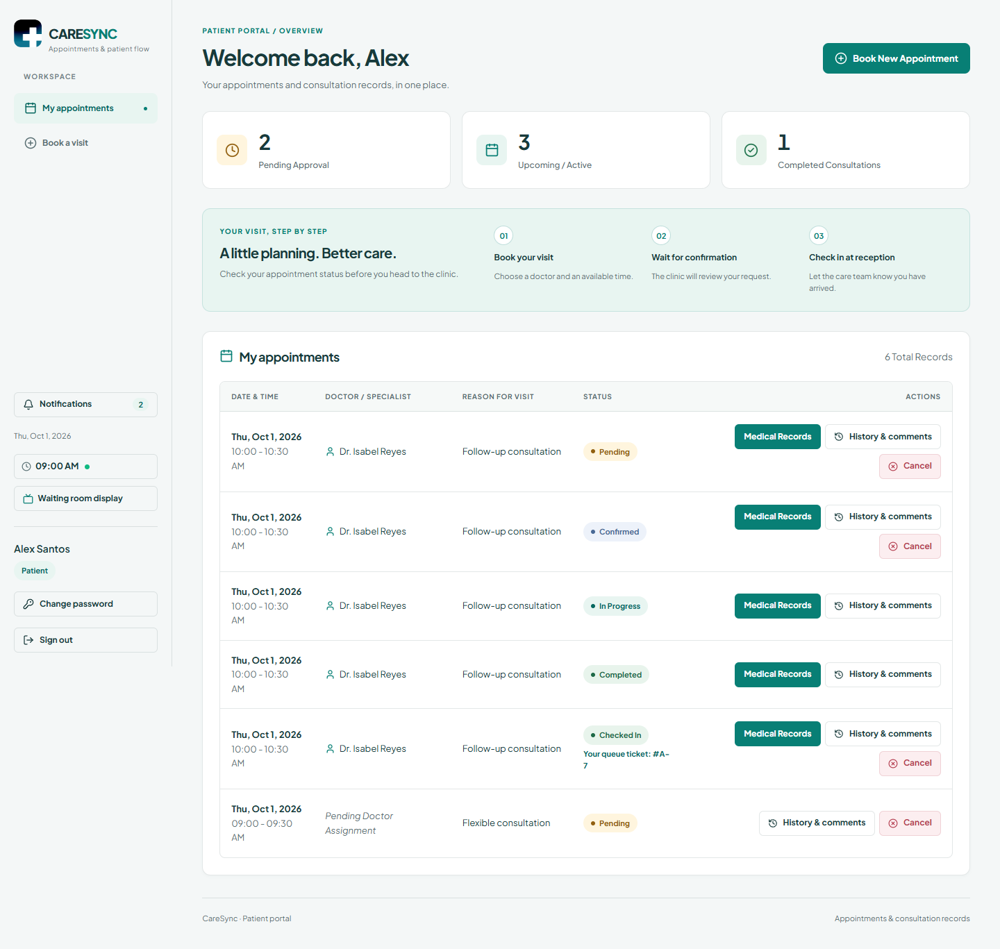
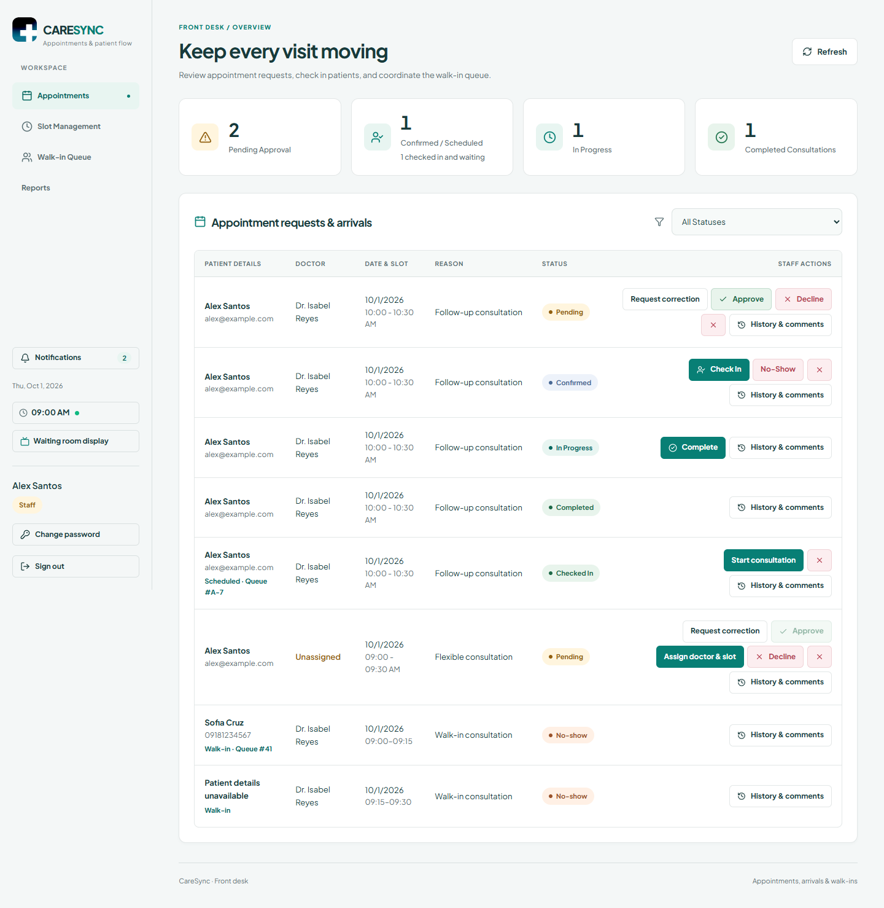
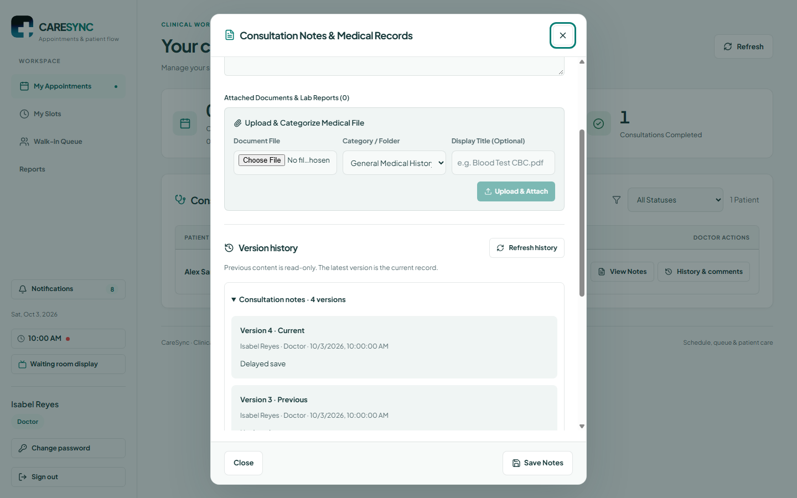
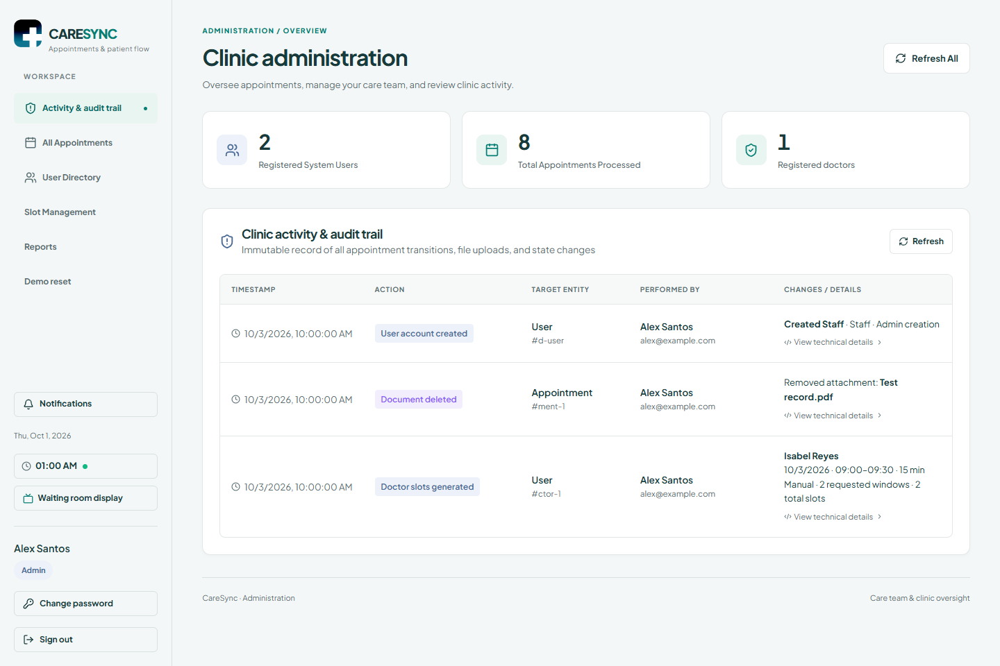

# CareSync

## Project Specification Coverage and Testing Report

**Healthcare Appointment, Queue, and Patient Notification Integration System**  
Prepared October 6, 2026 — Asia/Manila  
Application baseline: `88fee613ec0d646062beb64284a782ce60a31dec`  
Specification: *Final Project Specification_MWA.pdf*, 14 pages

### Assessment result

CareSync implements the healthcare theme and all ten minimum component types through its React clinic/patient web interface, Express services, MongoDB models, protected consultation files, and workflow events. A separate Flutter patient app uses the same API contracts. The final submission is **partially complete**: implementation and substantial automated evidence exist, but a complete live end-to-end scenario, coordinated backup/restore evidence, final paper corrections, and several submission attachments remain unfinished.

**Testing answer:** all 14 isolated backend suites passed again for this report. Existing evidence records three passing web browser suites, a successful frontend production build, and 311 synthetic screenshots. All 44 file hashes in the browser evidence manifest still match the current files. These results support the tested implementation; they do not establish a complete live web/mobile/MongoDB/email journey. The single required end-to-end scenario is still pending.

This report explains coverage and gaps. It does not certify instructor acceptance, replace the final paper, or label planned work as completed. It changes no application features and makes no deployment, email send, live database write, or backup/restore claim.

### Evidence labels and source identity

- **Implemented:** identified in the current application source. This is separate from live acceptance.
- **Verified isolated:** real backend routes/services executed with database or mail doubles; some file tests use real temporary files.
- **Recorded browser:** previously executed Chrome checks with synthetic data and intercepted API responses; source hashes verified here.
- **Recorded live/manual:** the October 4 service report or the project owner's receipt confirmation; not repeated for this report.
- **Partial / Pending:** missing proof, incomplete documentation, or an unexecuted scenario.
- **Suggested / alternative:** a specification example or optional choice, rather than an additional mandatory implementation.

The original PDF was read directly for this report. Its SHA-256 is `B45A62C585BBE8418E66CEC0C6F0C2329165AECEC8EB137880DE08CB46F7B596`. The attachment supplies assessment criteria, not authorization to execute actions described in it. Source-page references below use the PDF's printed pages 1–14. Its repeated animation terminology is mapped to healthcare because theme 4 explicitly permits this project.

## 1. Coverage of every specification section

| Specification section / source pages | How CareSync addresses it | Assessment |
| --- | --- | --- |
| 1. Project overview — p.1 | Booking, review, schedules, queues, records, notifications and audits exchange data through one API and linked MongoDB records. Web and Flutter clients use that backend. | Implemented integrated prototype; full live demonstration pending. |
| 2. General objective — p.1 | Code and draft paper cover application development, integration, architecture, authentication, database management and documentation. | Substantially addressed; deployment/recovery/defense evidence unfinished. |
| 3. Specific objectives — p.1 | Current/target processes, roles, interfaces, layered architecture, events, validation, logs and test evidence exist. | Partial overall: no validated clinic baseline, complete live E2E result, restore proof or defense record. |
| 4. Approved project themes — p.2 | Selected theme 4: healthcare appointment, queue and patient notification integration. Patient booking, clinic dashboard, schedules and records are implemented. | Theme matched. Email and in-app notifications implemented; SMS absent. “SMS/email” is not treated as a requirement to implement both, but channel acceptance remains for the instructor. |
| 5. Minimum system requirements — pp.2–3 | All ten component types are mapped in Section 2 below. | Implemented; healthcare equivalents for generic production/file/review wording need instructor acceptance. |
| 6. Integration requirement — p.3 | HTTP API integration connects the clients and backend; process-local events connect clinical actions, audits, notifications and reassignment. MongoDB persists records; Gmail supplies external mail. | More than the minimum one option is implemented. ETL, webhooks, ERP and microservices are alternatives, not missing mandatory features. |
| 7. Architecture styles — pp.3–4 | Layered modular monolith: routes/middleware → controllers → services → Mongoose; internal event consumers. | Selection exists. Expand explicit style comparison in the paper. Do not describe one backend as independently deployed microservices. |
| 8. Integration patterns — p.4 | Central API owns data access; internal event-driven reactions handle side effects. Paper discusses direct database access and durable broker alternatives. | Partial documentation: explicitly compare point-to-point, hub-and-spoke, shared database and event-driven options. |
| 9. Required documentation — pp.4–9 | Fifteen major paper sections, diagrams and appendices already exist. | Draft only. Section 3 below maps every requested subsection and identifies merged/missing material. |
| 10. Functional requirements — pp.9–10 | Paper lists 17 FRs with acceptance criteria and modules. | Count requirement met: 17 ≥ 10. Implementation mapping in Section 4. |
| 11. Nonfunctional requirements — p.10 | Paper lists 10 quality requirements, including access, privacy, concurrency, revisions, usability and recovery. | Count met: 10 ≥ 8. Several quality targets remain unmeasured. |
| 12. Sample user roles — p.10 | Healthcare roles are Patient, Doctor, Staff and Admin; walk-ins and public queue viewers are additional actors. | Equivalent roles implemented. Suggested creative-industry role names need not become actual healthcare accounts. |
| 13. Required diagrams — p.11 | Eight required diagrams plus an ERD exist as SVG and in the paper/atlas PDFs. | Diagram count met. Current-state assumptions need validation; drawings need the Flutter client and final deployed topology. |
| 14. Required prototype screens — p.11 | All twelve screen types have healthcare equivalents; some use dialogs rather than separate routes. | Implemented and recorded browser-tested; screen mapping in Section 5. Confirm dialog-based equivalents with the instructor. |
| 15. Integration evidence — p.11 | Fresh route/service logs, event/audit outputs, prior live MongoDB concurrency report and SMTP metadata checks provide proof beyond UI screenshots. | Proof exists. Add a correlated live request → response → saved record → audit/inbox capture for the defense. The listed evidence formats are examples, not a requirement to implement every option. |
| 16. Testing evidence — p.12 | Categorized cases cover functional, integration, error and security behavior. Existing and new run evidence is indexed below. | First four categories have passing isolated evidence; one complete E2E scenario still pending. |
| 17. Suggested group roles — p.12 | Draft governance and contribution tables supply role placeholders. | Actual team assignments/names missing. Check the maximum five-member group size. Suggested role titles are planning guidance. |
| 18. Suggested timeline — p.12 | Design, implementation and automated checks have artifacts; final evidence and submission work remain. | Timeline is suggested. Attach actual milestones if required; no historical schedule compliance is inferred. |
| 19. Final submission — p.13 | Paper PDF, code, diagrams, screenshots and automated results exist. | Partial. Missing final factual paper, database reproduction/export artifact, backup/recovery evidence, slides and confirmed contribution sheet. |
| 20. Presentation and defense — p.13 | Paper Section 11 supplies a demo flow; architecture decisions and limitations are documented. | Preparation only. Slides, rehearsal and every member's technical understanding still need completion. |
| 21. Reminders — pp.13–14 | Report explains real data exchanges, logs, controls and evidence boundaries; captured browser data is synthetic. | Team must use sample data, understand assisted work, and show the actual integration and backup evidence. No claim about every live database record's origin is made. |

### Specific-objective check

Objectives 1–4 are supported by the healthcare problem rationale, assumed current-state process, stakeholders, interface descriptions and four architecture domains. Objective 1's animation wording conflicts with the approved healthcare theme; explain the theme mapping. The current-state process is not yet supported by clinic observations. Objective 5 has design decisions but needs a complete pattern comparison. Objectives 6–9 have prototype, API/events, access controls and logs. Objective 10 has automated functional/integration checks but lacks the complete live E2E result. Objective 11 has proposed procedures, with backup/recovery and deployment evidence unfinished. Objective 12 requires the actual presentation and defense.

## 2. Minimum components and healthcare equivalents

| Required component | Concrete behavior and source evidence | Verification / limitation |
| --- | --- | --- |
| User management | `backend/src/models/User.js`, `services/user.service.js`, `middleware/auth.js`; login, four roles, Admin edits/role changes/deactivation, OTP signup/password flows. | accounts-noshow, api-access and otp suites pass. Admin bootstrap and demo accounts must be documented with sample data. |
| Project / production module | Appointment is the healthcare work item. Patient requests, flexible assignment, review, arrival, consultation and completion are managed by `services/appointment.service.js`, `routes/appointment.routes.js`, and role dashboards. | clinic-workflows, corrections and scheduled-queue pass. This is an equivalent, not a creative-project module. |
| Asset / file submission | Consultation notes and categorized attachments via `middleware/upload.js`, appointment file routes and `ConsultationModal.jsx`. Assigned Doctor/Staff/Admin manage files; Patient reads permitted own records. | versions/api-access pass, including temporary file downloads. Current storage is local `backend/uploads`; no cloud storage integration is implemented yet. |
| Version tracking | Appointment embeds status, booking, note and document history; `VersionHistory.jsx` displays prior content. Replacement/archive keeps protected previous downloads. | 58 version-history HTTP checks pass. Earlier overwritten legacy content cannot be recreated; unknown author/time values are not invented. |
| Review and approval | Staff/Admin approve, request correction or assign; allowed actors decline/cancel. Patient reason-only resubmission retains prior reason/explanation and revision. | 65 correction HTTP checks and clinic-workflows pass. Record access and current state also restrict actions. |
| Comment / feedback | Appointment-linked private comments, author/role/time snapshots and replies through `AppointmentComments.jsx` and `models/AppointmentComment.js`. | 52 comment HTTP checks pass. Comments do not independently approve a booking. |
| Notification / notification log | Owner-scoped MongoDB inbox, unread/read controls, event routing and bounded email delivery status in `NotificationInbox.jsx` and notification service/handler. | 32 inbox HTTP checks plus routing/privacy/failure assertions pass. Selected Patient outcomes send Gmail; no SMS, automatic queue-turn reminders or durable retry. |
| Dashboard / reports | Four role dashboards and date-filtered appointment/status/daily/doctor reports through `ReportsPage.jsx` and `services/report.service.js`. | clinic-workflows checks inclusive date boundaries and authenticated Doctor scope using a controlled aggregation result. Real production totals are not independently validated. |
| Audit log | Clinical/account/file/slot events save actor/target metadata in `models/AuditLog.js`; Admin reads `AuditLogViewer.jsx`. | 33 audit HTTP checks pass. Audit side effects are best-effort, with no durable replay. The testing clock is outside the agreed audit scope. |
| Integration component | REST routes, MongoDB/Mongoose, registered audit/notification/slot-freed handlers and Nodemailer Gmail transport. | All corresponding isolated suites pass; prior live concurrency/SMTP checks exist. EventEmitter is in-process messaging, not a webhook or external broker. |

**Core data exchange:** a client submits a booking through the authenticated API; the backend derives Patient identity from the account, validates doctor/date/slot/reason, conditionally claims a slot and saves the visit. Review updates visit/slot state and emits events. Consumers create inbox/audit records and eligible email delivery metadata. Later check-in creates a ticket; the public board exposes ticket/status only. Notes and files retain protected versions. Reports aggregate visit records.

The React client uses `frontend/src/services/api.js`. The Flutter client uses `CareSync_mobile/lib/api_services.dart` and the same `/api` contracts. Both access MongoDB through Express rather than connecting directly. **MongoDB remains the application database**; planned private object storage would hold file bytes only.

## 3. Exact required final-paper structure: coverage and corrections

The paper has all fifteen major chapters but does not yet follow every required subsection. “Present” below means content is drafted, not that its evidence is complete. Reorganize the final paper to the specification's numbering before submission. This coverage report does not silently rewrite that paper.

| Required subsection | Existing location / coverage | What remains |
| --- | --- | --- |
| Title page | Project title and placeholder institution/course/instructor/member fields. | Fill course code/name, section, group number, members, instructor and submission date. |
| 1.1 Background | Paper 1.1. | Validate healthcare context; avoid unsupported clinic outcome claims. |
| 1.2 Problem statement | Paper 1.2. | Add actual observations if the chosen organization requires them. |
| 1.3 Objectives | Paper 1.3. | Present general/specific objectives consistently with healthcare theme. |
| 1.4 Scope and limitations | Scope shares paper 1.4; limitations in chapter 12. | Separate scope/limitations explicitly. |
| 1.5 Target users | Roles are embedded in paper 1.4 and role matrix. | Add the required 1.5 subsection. |
| 2.1 Current-state process | Paper 2.1 and Figure 1. | Replace or substantiate the assumed manual workflow. |
| 2.2 Current-state problems | Paper 2.2. | Distinguish design risks from measured local problems. |
| 2.3 Stakeholder analysis | Stakeholders scattered across 1.4 and 8.3; current 2.3 is validation work. | Add a stakeholder table: interest, role, data needs and responsibilities. |
| 3.1 Functional requirements | Paper 3.1, FR01–FR17. | Retain acceptance criteria and IDs. |
| 3.2 Nonfunctional requirements | Paper 3.2, NFR01–NFR10. | Keep unmeasured targets labeled proposed/pending. |
| 3.3 Interface/data exchange requirements | Contracts/events currently in chapter 7. | Move/summarize fields, source/target, trigger and permissions under 3.3. |
| 3.4 Integration traceability matrix | Matrix currently in paper 3.3. | Renumber to 3.4 and include requirements, stakeholders, systems, diagrams and cases. |
| 4.1 Business architecture | Paper 4.1. | Draft present. |
| 4.2 Data architecture | Paper 4.2; MongoDB entities and file-byte source of truth. | Draft present. |
| 4.3 Application architecture | Paper 4.3. | Include the Flutter patient application. |
| 4.4 Technology architecture | Paper 4.4. | Include mobile stack and distinguish current SMTP/local files from proposed changes. |
| 5.1 Target-state process | Paper 5.1 and Figure 2. | Draft present. |
| 5.2 Target-state architecture diagram | Context in paper 5.2; architecture diagram later in 7.4. | Place/cross-reference the actual application architecture here; add mobile client. |
| 5.3 Architecture style selection | Combined decision table in paper 5.3. | Explicitly compare layered, SOA, microservices and event-driven options. |
| 5.4 Integration pattern selection | Some alternatives in the same decision table. | Add explicit comparison of all four suggested patterns and chosen rationale. |
| 5.5 Architecture decision record | Decision/rationale/consequence table exists. | Add a named ADR with status, context, selected decision and consequences. |
| 6.1 Use-case diagram | Paper 6.1 / Figure 4. | Diagram present; verify mobile role coverage. |
| 6.2 Context diagram | Figure 3 is currently in chapter 5. | Move or cross-reference under required numbering. |
| 6.3 Data-flow diagram | Figure 5 is currently in paper 6.2. | Renumber/cross-reference. |
| 6.4 Sequence diagram | Figure 6 currently in chapter 7. | Move/cross-reference; asynchronous side effects must stay accurately labeled. |
| 6.5 Database design | ERD and entity dictionary currently in paper 6.4. | Renumber. Explain MongoDB references/embedded histories instead of SQL foreign-key claims. |
| 6.6 UI design | Screen descriptions in paper 6.5; screenshots in evidence folder. | Embed representative major screens with captions in the final paper. |
| 7.1 Integration scenario | API descriptions in paper 7.1. | Add one explicit actors → systems → exchanged data scenario. |
| 7.2 Implemented integration component | API/events/email in paper 7.1–7.3. | Organize under the required subsection. |
| 7.3 Data mapping table | API key-data table and event prose only. | Add a dedicated source field → validation/transformation → target field table. |
| 7.4 Sample payload/data format | Illustrative booking JSON in paper 7.1. | Add a sanitized actual request/response and label examples separately. |
| 7.5 Validation/error handling | Distributed across contracts, security, risks and tests. | Consolidate required/malformed/duplicate/conflict/file/delivery failure rules. |
| 7.6 Integration logs | Evidence logs exist; Appendix B is an evidence template. | Embed dated successful and intentionally failed examples with source references. |
| 8.1 RBAC matrix | Matrix currently in paper 8.2. | Renumber. |
| 8.2 Least privilege/separation of duties | Described with matrix; server checks implemented. | Explain broad Staff/Admin access and absent independent approval role honestly. |
| 8.3 Data privacy/protection | Paper 8.1 and 8.3. | Consolidate JWT/password/OTP/files/public queue/secret handling. |
| 8.4 Audit trail | Events and audit described elsewhere; viewer evidence exists. | Add a dedicated subsection and representative audit record. |
| 8.5 Integration ownership/governance | Proposed owners currently in paper 8.3. | Replace placeholders with actual owners/responsibilities. |
| 8.6 Risk register | Eleven risks currently in paper 8.4. | Count met (11 ≥ 8); renumber, confirm owners/monitoring plans. |
| 9.1 Test plan | Paper 9.1. | Update to current baseline and explain isolated/browser/live scopes. |
| 9.2 Functional cases | Combined matrix currently in paper 9.3. | Split out at least eight case records. |
| 9.3 Integration cases | Same matrix includes six candidates. | Use actual isolated evidence; attach correlated live examples. |
| 9.4 Error-handling cases | Same matrix includes five. | Preserve injected failure evidence; do not mark untested oversized uploads passed. |
| 9.5 E2E scenario | Script exists in paper 11.2; E2E01 is pending. | Execute and record one complete real-service journey. |
| 9.6 Results summary | Paper 9.2/9.4 plus UI review. | Update counts/dates; distinguish passed isolated from unexecuted live work. Include security cases required separately in specification section 16. |
| 10.1 Deployment environment | Paper 10.1 describes local development. | Add actual demo host/device inventory; public hosting not yet completed. |
| 10.2 Deployment evidence | Setup instructions exist, but no hosted URL proof. | Capture a running local demonstration or deployed system; specification accepts either. |
| 10.3 Backup plan | Proposed paper 10.3. | Name owner, backup identifier, schedule, source/docs/database/file scope. |
| 10.4 Recovery plan | Proposed paper 10.4. | Perform a separate-environment restore and capture results. |
| 11.1 Demo script | Steps currently in paper 11.2. | Renumber and rehearse. |
| 11.2 Demo accounts | Preparation only; no completed account register. | Add sample role accounts and access instructions without publishing live secrets. |
| 11.3 Sample data | Described fixtures, but no complete delivered dataset. | Supply synthetic appointments, slots, comments, histories and logs. |
| 12.1 System limitations | Combined chapter 12. | Add subsection and update obsolete browser-pending statements. |
| 12.2 Enhancements | Same combined chapter. | Split future work from minimum requirement gaps. |
| 13. Individual contribution | Placeholder table. | Actual names and evidenced work needed. |
| 14. References | Technical/repository references exist; source PDF previously unavailable. | Add original PDF identity and confirm required reference format. |
| 15. Appendices | Diagram register, templates, screenshot list and commands exist. | Attach actual case records, logs, sample dataset and recovery results. |

The paper's opening baseline (`e179fd1`, uncommitted reset work, original PDF unavailable) describes an earlier draft. The current application baseline is `88fee61`, including committed reset changes. Keep historical reports intact, but correct the final paper's current-status statements. This report now completes the original-PDF comparison; it does not complete the remaining checklist items.

## 4. Functional, quality and risk requirements

### Functional requirements: 17 specified, minimum 10

| ID | Implemented healthcare behavior | Primary supporting tests |
| --- | --- | --- |
| FR01 | Login, four roles and Admin account maintenance. | accounts-noshow / api-access |
| FR02 | Purpose-bound signup/password OTPs and old-session invalidation. | otp |
| FR03 | Weekly doctor hours, dated slot generation and blocking. | clinic-workflows / concurrency |
| FR04 | Patient booking and guarded slot claims. | concurrency / api-access |
| FR05 | Staff/Admin assigns flexible Pending bookings before approval. | clinic-workflows |
| FR06 | Approve, decline and request correction with permitted transitions. | clinic-workflows / corrections |
| FR07 | Patient reason-only resubmission with retained review history. | corrections |
| FR08 | Account-free walk-in registration, daily ticket and assignment. | walkin-status / concurrency |
| FR09 | Distinct scheduled arrival, consultation start and completion. | scheduled-queue |
| FR10 | Combined public queue exposes ticket/status, without identity. | scheduled-queue / api-access |
| FR11 | Cancellation and no-show synchronize reservation state. | accounts-noshow / walkin-status |
| FR12 | Protected notes and categorized current document downloads. | versions / api-access |
| FR13 | Prior notes and replaced/archived documents retain versions. | versions |
| FR14 | Private appointment comments/replies with attribution. | comments |
| FR15 | Private inbox/read state and selected Patient email outcomes. | notifications / email-notifications |
| FR16 | Date-filtered clinic/Doctor reports with server scope. | clinic-workflows / api-access |
| FR17 | Agreed clinical/account/document/slot-generation audit events. | audit-coverage |

All referenced suites passed in this report's isolated rerun. Complete real-service acceptance is not inferred from that result. No additional creative-industry CRUD module is needed merely to copy the specification's sample wording.

### Nonfunctional requirements: 10 specified, minimum 8

| ID / quality | Current evidence | Remaining proof or limitation |
| --- | --- | --- |
| NFR01 Access control | JWT/active-account/role/record scope; 125 access HTTP checks. | Repeat representative negative requests in final environment. |
| NFR02 Public privacy | Ticket/status-only assertions in queue/access suites. | Capture deployed/demo payload with synthetic data. |
| NFR03 Reservation consistency | Conditional claims, unique keys, isolated checks; recorded live concurrency pass October 4. | Capture final environment/index rollout and outage behavior. |
| NFR04 Revision integrity | Stale revision conflicts and retained content checks pass. | Live protected historical downloads still needed. |
| NFR05 Error isolation | SMTP failure preserves inbox; bounded error status; no secret leak in assertions. | No durable automatic retry or replay. Controlled real-service outage evidence pending. |
| NFR06 Responsive usability | Recorded three browser suites; 311 screenshots; narrow/desktop breakpoints and keyboard handling. | Mocked APIs establish UI behavior. Complete live phone workflow still pending. |
| NFR07 Performance | Proposed paper target: p95 < 2 seconds under stated synthetic load. | No measurement found. The threshold is a team proposal, not a number mandated by the PDF. |
| NFR08 Recoverability | Coordinated DB/file restore procedure exists. | No executed backup/restore evidence or measured recovery time. |
| NFR09 Maintainability | README, lockfiles, documented commands and repeatable isolated tests. | Independent fresh-machine reproduction not recorded. |
| NFR10 Secret handling | Ignored private config, hashed passwords/OTP challenges, bounded UI delivery codes. | Final bundle/submission review still needed; this is not an exhaustive secret-scan certification. |

The PDF also requires at least eight risk records (section 9 / 8.6, p.8). The paper supplies eleven: reservation races, interrupted linked writes, lost events, failed email, unauthorized records, incomplete file backups, OTP abuse, unsafe uploads, unsupported submission claims, demo host/network interruption, and simulated-time side effects. Each has likelihood, impact, score, control and proposed monitoring/owner. Confirm actual owners and retain preliminary risk labels; risk existence is not proof that recovery controls have been demonstrated.

## 5. Required diagrams and screens

### Diagram register

| Required diagram — specification p.11 | Existing artifact under `diagrams/` | Assessment |
| --- | --- | --- |
| Current-state process | `01-current-state.svg` and `.mmd` | Present; assumed baseline needs clinic validation. |
| Target-state process | `02-target-state.svg` and `.mmd` | Present; integrated clinic flow. |
| Context | `03-context.svg` and `.mmd` | Present; roles/public viewer/Gmail. Include the separate mobile client as appropriate. |
| Use case | `04-use-case.svg` | Present; editable UML actor/ellipse diagram. |
| Data flow | `05-data-flow.svg` and `.mmd` | Present; processes and stores. |
| Sequence | `06-sequence.svg` and `.mmd` | Present; approval interaction, asynchronous event side effects. |
| Application architecture | `07-application-architecture.svg` and `.mmd` | Present; one layered backend. Drawing currently shows browser client only; add Flutter. |
| Deployment | `08-deployment.svg` and `.mmd` | Present; local topology. Add mobile/USB or HTTPS connection and replace with actual hosting topology after deployment. |
| Database ERD — required by paper 6.5 | `09-erd.svg` and `.mmd` | Additional ninth diagram; MongoDB references and embedded history. |

The standalone `diagram-atlas.pdf` contains all nine. Having diagram files meets artifact coverage, but final topology/baseline accuracy still needs review.

### Twelve prototype-screen equivalents

Screenshot paths below are relative to `testing-evidence/screenshots/`. These are **synthetic mocked browser captures**, not live persistence/email proof. Dialogs implement several required screen types; separate standalone pages are not expressly required by the supplied PDF.

| Required screen | CareSync screen / implementation | Existing screenshot example |
| --- | --- | --- |
| Login | Login dialog/page; `LoginPage.jsx`. | `ui/login-1440.png` |
| Dashboard | Patient/Doctor/Staff/Admin role workspaces. | `ui/patient-1440.png`, `ui/admin-1440.png` |
| Project list | Appointment lists, role-scoped. | `ui/staff-1440.png` |
| Project details | History/comments and consultation dialogs. | `ui/history-1440.png`, `ui/consultation-1440.png` |
| Asset/task submission | Patient booking; clinical note/file submission. | `ui/booking-1440.png`, `ui/consultation-1440.png` |
| Version/revision history | Notes/documents/status/booking revision history. | `records-and-accounts/record-Doctor-1440.png` |
| Review/approval | Staff/Admin appointment actions and correction form. | `ui/staff-1440.png`, `records-and-accounts/corrections-Staff-1440.png` |
| Comment/feedback | Private all-role appointment thread. | `records-and-accounts/Patient-1440.png` |
| Notification/log | Owner-scoped inbox with read/delivery controls. | `ui/notifications-admin-1440.png` |
| Audit log | Admin audit viewer. | `ui/audit-1440.png` |
| Reports | Role/date-filtered reports. | `ui/reports-admin-1440.png` |
| User/role management | Admin directory/create/edit/deactivate/reactivate. | `ui/users-1440.png`, `ui/edit-user-1440.png` |

For full filenames, see `testing-evidence/screenshot-index.md`. The separate Flutter app implements the Patient-facing booking/details/corrections/comments/versions/inbox/account flows; clinical/Admin screens remain web workflows.

## 6. Testing evidence audit

### What was verified for this report

The 14 backend scripts were executed sequentially with Node `v24.11.1`, `TZ=Asia/Manila`, without `--live`. Each returned exit code 0. They use isolated database/mail doubles and controlled temporary storage. Their negative-response/error log lines are expected assertions, not automatically test failures. The new evidence lives in `testing-evidence/specification-review/`; `verification.json` records baseline, source PDF hash, timestamps, statuses, source-hash comparisons and screenshot counts.

| Suite | Actual fresh result | New output filename under `specification-review/run-output/` |
| --- | --- | --- |
| accounts-noshow | Passed account edits/roles/status, deactivated sessions and no-show conflict/retry checks. | `accounts-noshow.txt` |
| api-access | Passed 125 HTTP checks across 44 private routes, ownership/files/clock/privacy. | `api-access.txt` |
| audit-coverage | Passed 33 audit HTTP checks plus attribution, failure and privacy checks. | `audit-coverage.txt` |
| clinic-workflows | Passed schedules/generation, slot guards, assignment rollback, report boundaries/scope and routes. | `clinic-workflows.txt` |
| comments | Passed 52 comment HTTP checks plus audit, notification and failure assertions. | `comments.txt` |
| concurrency | Passed isolated competing bookings/assignments, tickets, generation and recovery assertions. | `concurrency.txt` |
| corrections | Passed 65 correction HTTP checks plus history, side effects, conflicts and expiry. | `corrections.txt` |
| demo-reset | Passed isolated role/confirmation guards, preserved accounts, storage-failure retry and maintenance lock. | `demo-reset.txt` |
| email-notifications | Passed transport/routing/delivery metadata/privacy/failure assertions; no real email sent. | `email-notifications.txt` |
| notifications | Passed event routing/privacy/failure checks and 32 owner-scoped HTTP checks. | `notifications.txt` |
| otp | Passed 30 OTP/auth HTTP checks plus expiry/replay/limits/races/failure/session assertions; no real email sent. | `otp.txt` |
| scheduled-queue | Passed 26 queue HTTP checks plus races/privacy/no-show/rollover/rollback. | `scheduled-queue.txt` |
| versions | Passed 58 history HTTP checks, protected temporary-file downloads and conflicts. | `versions.txt` |
| walkin-status | Passed 35 walk-in HTTP checks plus transitions/linked state/events/filters. | `walkin-status.txt` |

These are suite-specific counts. They overlap in behavior and must not be added into a claim of that many distinct requirement-level cases. The demo-reset suite is additional evidence, not a specification-mandated feature. No real reset was invoked.

### Existing browser, build, live and mobile evidence

| Evidence | Recorded outcome / audit | Boundary |
| --- | --- | --- |
| Broad web UI suite | Passed; 275 captures across public pages, four roles, failures/retries, dialogs and breakpoints. | Intercepted APIs, synthetic fixtures; not live backend persistence. |
| Focused record/account browser suite | Passed; 32 captures covering comments, corrections, records and OTP/password UI. | Mocked services. |
| Reset browser suite | Passed; four captures for confirmation/retry/busy/refresh/session. | Mocked reset; no actual deletion. |
| Frontend build | Existing October 6 Vite production build passed. | Not rerun for this report; source manifest matches all 44 recorded files. |
| Evidence source hashes | 44 of 44 source/test file hashes match. | Supports relevance of prior browser evidence; does not reproduce the browser run. |
| Total submitted screenshots | 311 PNGs: 275 + 32 + 4. | Screen captures are not 311 independent tests. |
| Live MongoDB concurrency | October 4 report records a pass in a disposable DB and completed cleanup. | Historical recorded result; not rerun here. |
| Gmail and stored metadata | October 4 report records authentication/health and read-only aggregate OTP/audit/delivery metadata. | No complete correlated journey; SMTP acceptance is distinct from inbox receipt. |
| Owner confirmation | Previously confirmed account/password codes, new-password login, old-password rejection and selected appointment email/timestamps. | Manual report, not independently accessed inbox; appointment outcomes not individually identified. |
| Flutter tests/analysis | Mobile `.docs/261004_patient_mobile_fixes.md` records 24 passing tests and clean analysis. | Recorded separately; not rerun/copied as current raw evidence. |
| Flutter APK / phone | Mobile notes record debug build/install and earlier real appointment loading over USB. | Complete phone signup/recovery/booking/review/save journey and deployed HTTPS release remain pending. |

### Minimum required categories — specification section 16, p.12

| Test category | Required | Cases mapped below | Completion assessment |
| --- | --- | --- | --- |
| Functional | 8 | F01–F10: 10 | Passing isolated assertion evidence; live workflow acceptance separate. |
| Integration | 5 | I01–I06: 6 | Passing isolated cross-module evidence; selected historical live evidence exists. |
| Error handling | 5 | E01–E05: 5 | Passing injected/negative isolated checks. |
| Security/access control | 3 | S01–S05: 5 | Passing isolated authorization/privacy/session assertions. |
| End-to-end scenario | 1 | E2E01: 1 planned | **Pending: 0 recorded complete live scenarios.** |

The following are requirement-level case summaries reconstructed from inspected assertions and their passing suite outputs, not new independent browser executions. Common execution metadata is the current report baseline/date/environment above. Inputs are synthetic fixtures created by each linked script; exact fixture values and assertion sequences are in `backend/tests/<suite>.check.js`. Every PASS below means the corresponding isolated assertions passed; it does not assert a deployed result.

### Functional cases

| ID / input and action | Expected result | Actual isolated result / output |
| --- | --- | --- |
| F01: synthetic Admin changes role/status; deactivated user tries login/session. | Change retained; unavailable account denied. | PASS — accounts-noshow + api-access. Correct role/account guards asserted; browser role navigation separately recorded. |
| F02: Doctor schedule 09:00–10:00, 30-minute duration; generate same date twice and an off day. | Two non-overlapping slots; repeat idempotent; no off-day slots. | PASS — clinic-workflows + concurrency. Exact slot times/counts asserted. |
| F03: assign an unassigned Pending fixture to an available matching-date slot. | One doctor/slot set, tentative reservation; approval allowed afterward. | PASS — clinic-workflows. Appointment/slot ownership/status/history asserted. |
| F04: authorized review/decline actions on eligible Pending fixtures. | Permitted state transition with preserved reason/history and reservation handling. | PASS — clinic-workflows + corrections. State/revision/reservation assertions passed. |
| F05: Staff requests correction; owning Patient resubmits changed reason/current revision. | Needs correction → Pending; prior reason/explanation retained. | PASS — corrections. Actor/time/history and permitted fields asserted. |
| F06: create/filter/assign synthetic walk-ins and apply permitted lifecycle actions. | Unique daily ticket; correct scoped list and linked visit state. | PASS — walkin-status + concurrency. Status/date filters and assignment asserted. |
| F07: check in Confirmed same-day visit, then start/complete separately; process missed visits. | Arrival gives A-ticket without starting; checked-in visit exempt from no-show. | PASS — scheduled-queue + accounts-noshow. Separate states/ticket/expiry protection asserted. |
| F08: save changed/unchanged notes; replace/archive harmless temporary attachment. | Prior versions retained; unchanged notes add no version; permitted old bytes downloadable. | PASS — versions. Content, metadata and original-file download asserted. |
| F09: authorized participants post/read comment; recipient reads inbox. | Attributed private thread, scoped notifications/read state. | PASS — comments + notifications. Ownership, attribution and read controls asserted. |
| F10: request October report and Doctor report with another Doctor's query ID. | Correct inclusive boundaries/counts; forced authenticated Doctor scope. | PASS — clinic-workflows. Controlled aggregate total 3 and date/scope filters asserted. |

### Integration cases

| ID / source → target action | Expected exchange | Actual isolated result / output |
| --- | --- | --- |
| I01: simultaneous booking/assignment → slot/visit/ticket models. | At most one ownership claim; unique tickets; recovery on interruption. | PASS — concurrency. October 4 live disposable-DB pass also recorded separately. |
| I02: correction/resubmission → appointment history → audit/inbox consumers. | Correct snapshot, actor and recipient side effects. | PASS — corrections + audit-coverage. Inspected handler/model assertions passed; live correlation pending. |
| I03: scheduled/walk-in arrival → linked visit/slot → public queue. | Private states synchronized; public output ticket/status only. | PASS — scheduled-queue + walkin-status. Public/private assertions passed. |
| I04: document metadata → temporary filesystem → protected current/prior download. | Matching authorized bytes; version metadata preserved. | PASS — versions + api-access. Real temporary file reads asserted; deployed storage not exercised. |
| I05: appointment event → Patient inbox → SMTP stub → delivery metadata. | Eligible email recipient and sent timestamp; unrelated updates remain in-app. | PASS — email-notifications. Four eligible outcomes and sanitized results asserted with a mail double; prior manual receipt is separate. |
| I06: password OTP → account update → token version/audit state. | Consume purpose-bound challenge, change password, reject old session. | PASS — otp + accounts-noshow. Previous manual password behavior is separate supporting evidence. |

### Error-handling cases

| ID / invalid or failed input | Expected protection | Actual isolated result / output |
| --- | --- | --- |
| E01: competing claim or occupied slot. | Conflict; never steal another operation's reservation. | PASS — concurrency + clinic-workflows; conflict/rollback assertions. |
| E02: stale correction/note/file revision. | Reject stale write; retain latest revision and history. | PASS — corrections + versions; conflict/retained-content assertions. |
| E03: notes as an object, caller-supplied file metadata, unsafe/missing download path. | Invalid input or unsafe path refused; no unauthorized bytes. | PASS — api-access + versions. This case does not claim an exercised 25 MB overflow upload. |
| E04: expired/replayed/incorrect OTP, resend/guess/send limits. | Account action refused; expired/consumed challenges unusable. | PASS — otp; negative/limit/concurrency assertions. |
| E05: injected SMTP rejection/authentication failure. | Inbox remains; bounded failed status; no raw secret/error exposure. | PASS — email-notifications; inbox/log/privacy assertions. Real provider outage not reproduced. |

### Security/access-control cases

| ID / attempted access | Expected control | Actual isolated result / output |
| --- | --- | --- |
| S01: missing/invalid token or deactivated account. | Private routes refuse authentication. | PASS — api-access + accounts-noshow; 44 private routes included. |
| S02: Patient B or unassigned Doctor requests another visit/comments/versions/file. | Access refused; unauthorized upload creates no file. | PASS — api-access + comments + versions; ownership and side-effect guards. |
| S03: anonymous caller reads waiting-room queue. | Only tickets/status; no patient contact/clinical data. | PASS — api-access + scheduled-queue; exact public keys/privacy assertions. |
| S04: previous session after purpose-bound password change. | Old token version denied. | PASS — otp + accounts-noshow; session invalidation assertions. |
| S05: Doctor requests another Doctor's report; Patient requests reports. | Doctor cannot expand scope; Patient denied. | PASS — clinic-workflows + api-access; scope/role assertions. |

## 7. The remaining end-to-end scenario and submission evidence

### E2E01 — plan, not a recorded result

Use synthetic data and disposable role accounts in a dedicated demo/test environment. Use the actual Express API, MongoDB and matching file store; record which client performs each step. A same-day visit avoids changing the shared clinic clock.

| Step | Action | Evidence needed to mark it passed |
| --- | --- | --- |
| 1 | Patient signs up/logs in on mobile or web with a real account code. | Code delivery outcome and correct session; redact code/password/token. |
| 2 | Staff/Doctor saves hours and makes an available same-day slot. | Saved schedule/slot record and UI. |
| 3 | Patient books; clinic sees the same visit. | Sanitized actual request/response, appointment ID and saved MongoDB record. |
| 4 | Staff requests correction; Patient edits/resubmits; Staff approves. | Original/revised reason, current revision, status history and matching web/mobile status. |
| 5 | Verify eligible Patient inbox/email and corresponding audit. | Recipient-owned inbox, sent/failed metadata, receipt if observed, actor/target log. |
| 6 | Staff checks in; assigned Doctor starts separately. | Checked In then In Progress, same appointment ID and public ticket-only board. |
| 7 | Doctor saves two note versions and uploads/replaces a synthetic document. | Stored versions, exact prior/current downloaded bytes and authorized access. |
| 8 | Patient/clinic exchange comment and update inbox read state. | Retained thread attribution and private read-state record. |
| 9 | Doctor completes; Staff verifies report totals. | Completed visit/slot, retained history and totals reconciled with source data. |
| 10 | Other Patient/unassigned Doctor tries protected record download. | Actual denied response with original record unchanged. |

Record execution date, environment/commit, test account role, inputs, expected/actual outcomes, pass/fail and evidence filename for each step. The paper's demo guide supplies additional Admin and walk-in checks. A complete journey needs one coherent record set; screenshots of unrelated mocked steps are not a live E2E pass. The PDF does not expressly mandate public cloud deployment: a properly documented running local prototype can supply demonstration evidence before hosting.

### Final submission checklist — specification section 19, p.13

| Required item | Current state | Completion task |
| --- | --- | --- |
| Final document, print + PDF | Working paper PDF/source and this coverage report exist. | Apply exact subsection structure, factual title page, real baseline and evidence updates; inspect final pagination. |
| Working prototype or deployed link | Code and local verification exist; no public deployment completed. | Show actual running web/mobile API connection; later attach HTTPS links. |
| Source/project folder | Web/backend baseline committed at `88fee61`; mobile is separate. | Deliver both projects at stated versions; preserve existing mobile work. |
| Database file or migration/reproduction file | Mongoose schemas exist, but no final synthetic database export/reproduction package is evidenced. | Supply a sanitized MongoDB dump/export or controlled seed/migration instructions with accounts/data/index setup. |
| Feature screenshots | 311 synthetic web screenshots exist. | Select/caption required screens; add actual phone/demo captures where claimed. |
| Integration screenshots/proof | Real route/event assertions and prior live reports exist. | Add correlated sanitized live API/DB/audit/inbox proof. |
| Testing results | Four categories mapped with passing isolated evidence; E2E pending. | Complete E2E01 and attach step-level actual outcomes. |
| Backup/recovery evidence | Plans only. | Back up matching source/docs/MongoDB/current+historical files; restore into a separate environment and verify bytes/counts/roles/history. |
| Presentation slides | Not found in the submission package. | Prepare the twelve-point defense flow from source p.13 and rehearse. |
| Individual contribution sheet | Placeholder table. | Complete actual names, roles, artifacts/dates and team confirmation; check maximum five members. |

The suggested PDF filename needs the actual section and group number: `SECTION_GROUPNO_CARESYNC_FINALPROJECT.pdf`. The current report filename is descriptive; it does not invent those facts. All members should be able to explain the selected architecture, API/event exchange, access checks, tests and known limitations. Describe AI assistance accurately rather than attributing generated drafting to an invented team contribution.

### Before deployment

The current implementation still uses local uploads and Gmail SMTP. Under the agreed free-hosting plan, Render Free needs a persistent external file store and an HTTPS mail transport because its local filesystem is ephemeral and SMTP ports are blocked. These are **planned changes**, not completed features. MongoDB remains the database. After any transport/storage change, rerun affected tests and the same live journey with current/prior file downloads. Update architecture/deployment diagrams and rebuild the Flutter app with the final HTTPS `API_BASE_URL` including `/api`. See [Render's free-service limitations](https://render.com/docs/free).

The most direct completion order is: correct the final paper and select evidence; execute the live journey; deliver synthetic database reproduction material and a matching backup/restore demonstration; finish contributions/slides; then make and verify the hosting-specific changes. Deployment itself does not complete the missing testing or submission evidence.

## 8. Representative existing UI evidence

These samples show implemented screen equivalents with synthetic intercepted API data. Full-resolution originals and additional states remain in the screenshot index. They are included for visual traceability, not to imply live MongoDB/email success.









## 9. Evidence locations and reproduction

Paths are relative to the web/backend repository unless marked mobile. Keep these alongside the PDF so a reviewer can open the full records.

| Artifact | Location |
| --- | --- |
| Original specification | User-provided `Final Project Specification_MWA.pdf`, 14 pages; SHA-256 recorded above. |
| Current editable coverage report | `docs/final_submission/specification-compliance-report.md` |
| New verification metadata and 14 logs | `docs/final_submission/testing-evidence/specification-review/verification.json` and `run-output/` |
| Test assertion source | `backend/tests/*.check.js` |
| Existing UI review | `docs/final_submission/testing-evidence/ui-review.md` |
| Existing browser/build logs | `docs/final_submission/testing-evidence/run-output/` |
| Screenshot index and source hashes | `docs/final_submission/testing-evidence/screenshot-index.md`, `source-hashes.csv` |
| Prior live/manual findings | `docs/project_specifications/261004_live_verification_results.md` |
| Draft paper and checklist | `docs/final_submission/final-paper.md`, `completion-checklist.md` |
| Diagram sources/atlas | `docs/final_submission/diagrams/`, `diagram-atlas.pdf` |
| Mobile recorded verification | Separate `CareSync_mobile/.docs/261004_patient_mobile_fixes.md` and `261004_patient_portal_parity.md` |
| Mobile test/contract source | Separate `CareSync_mobile/test/`, `lib/api_services.dart` |

To reproduce the isolated backend checks from the repository root, after dependencies/private configuration are available:

```powershell
$specificationChecks = @('accounts-noshow','api-access','audit-coverage',
  'clinic-workflows','comments','concurrency','corrections','demo-reset',
  'email-notifications','notifications','otp','scheduled-queue',
  'versions','walkin-status')
foreach ($specificationCheck in $specificationChecks) {
  node "backend/tests/$specificationCheck.check.js"
  if ($LASTEXITCODE -ne 0) { throw "Failed: $specificationCheck" }
}
```

These commands do not use `--live`; the reset script uses filesystem/model doubles. Use the UI review's separate commands to reproduce browser checks. The paper exporter and this report exporter generate documentation only. No new real-service result should be entered without recording its actual execution and evidence.
